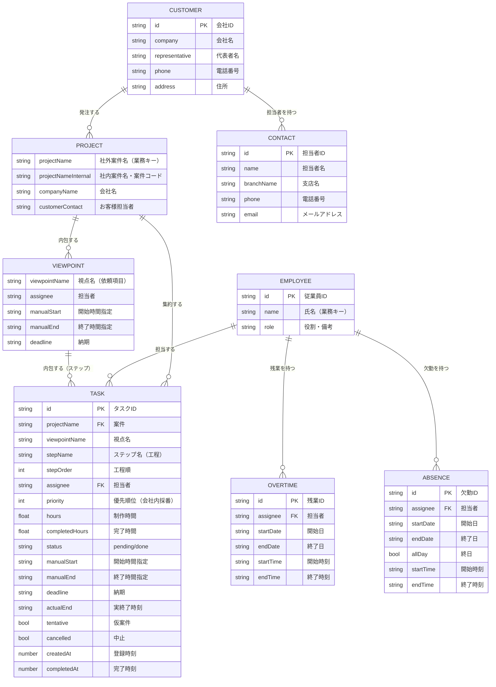

# ER図・データモデル設計書

| 項目 | 内容 |
|---|---|
| システム名称 | 工程図（koutei-zu） |
| 版数 | 1.0 |
| 作成日 | 2026-06-13 |
| データストア | Google Cloud Firestore（ドキュメント指向NoSQL） |

---

## 1. 概要

本システムは関係データベースではなく **Firestore（NoSQL）** を採用している。
このため本書では以下の2層で表現する。

1. **論理データモデル（ER図）** … 業務エンティティの関係を論理的に表現（正規化された姿）。
2. **物理データモデル（Firestore構造）** … 実際の格納形態（コレクション／ドキュメント／非正規化）。

> 注意：Firestoreは非正規化前提のため、論理的な「子テーブル」が親ドキュメント内に配列で埋め込まれている箇所がある（マスタ系）。一方、タスクは「1タスク=1ドキュメント」として独立コレクションに格納している（同時編集耐性のため）。

---

## 2. 論理データモデル（ER図）



> 補足：論理上「PROJECT」「VIEWPOINT」は独立エンティティだが、物理的には実体テーブルを持たず、TASK の属性（projectName / viewpointName 等）からアプリ側で動的に集約（グループ化）して再構成している。業務キーは `projectName`（案件）、`assignee::projectName::viewpointName`（視点）。

---

## 3. 物理データモデル（Firestore構造）

### 3.1 コレクション・ツリー

```
workspaces/{WORKSPACE_ID}/
├── tasks/{taskId}                 … タスク（1件=1ドキュメント）
└── data/{key}                     … 汎用KVストア（1キー=1ドキュメント）
        ├── settings               … 営業時間・残業・欠勤・表示順等の設定
        ├── customerMaster         … お客様マスタ（配列を value にJSON格納）
        ├── employeeMaster         … 従業員マスタ（配列を value にJSON格納）
        ├── projectOrder           … 案件の手動並び順（配列）
        └── deletedExternalIds     … 外部同期削除済みID（配列）
```

- `WORKSPACE_ID` … チーム共有の区切り（例：`liebe-asia-team`）。同一IDで同一データを共有。
- `tasks` … タスクは独立ドキュメント。差分書き込み（変更分のみupsert）で同時編集に強い。
- `data` … Claude.ai の `window.storage` 互換の汎用KV。`{ value: <JSON文字列 or オブジェクト>, updatedAt }` を格納。

### 3.2 エンティティ定義

#### (1) Task（`tasks/{taskId}`）

| 物理名 | 型 | 必須 | 説明 |
|---|---|---|---|
| id | string | ○ | タスクID（`task-{timestamp}-{seq}-{rand}`）。ドキュメントIDと一致。 |
| projectName | string | ○ | 社外案件名（案件の業務キー）。 |
| projectNameInternal | string | | 社内案件名・案件コード。 |
| companyName | string | | 会社名。 |
| customerContact | string | | お客様担当者名。 |
| viewpointName | string | ○ | 視点名（依頼項目）。 |
| stepName | string \| null | | ステップ名（工程）。 |
| stepOrder | number \| null | | 視点内のステップ順（0始まり）。 |
| assignee | string | ○ | 制作担当者。 |
| priority | number | ○ | 優先順位（会社ごとに1から採番、小さいほど優先）。 |
| hours | number | ○ | 制作時間（h）。 |
| completedHours | number | ○ | 完了時間（h）。既定0。 |
| memo | string | | メモ。 |
| tentative | boolean | | 仮案件フラグ。 |
| deadline | string \| null | | 納期（`YYYY-MM-DD`、視点単位）。 |
| manualStart | string \| null | | 開始時間指定（`YYYY-MM-DDTHH:mm`）。 |
| manualEnd | string \| null | | 終了時間指定（`YYYY-MM-DDTHH:mm`）。 |
| status | string | ○ | `pending` / `done`。 |
| completedAt | number \| null | | 完了時刻（epoch ms）。 |
| actualEnd | string \| null | | 実終了時刻（`YYYY-MM-DDTHH:mm`、完了時に記録）。 |
| cancelled | boolean \| null | | 中止フラグ（実績は残すが後続スケジュールに影響させない）。 |
| delays | array \| undefined | | 遅延履歴 `[{ at, from, to }]`（epoch ms）。 |
| createdAt | number | ○ | 登録時刻（epoch ms）。優先同列の並びにも使用。 |
| externalId | string \| undefined | | 外部シート由来タスクの識別子。 |

#### (2) Settings（`data/settings`）

`value` に以下のオブジェクトを格納。

| 物理名 | 型 | 説明 |
|---|---|---|
| morningStart / morningEnd | string | 午前の営業時間（既定 08:00 / 12:00）。 |
| afternoonStart / afternoonEnd | string | 午後の営業時間（既定 13:00 / 17:00）。 |
| startDate | string | スケジュール起点日（`YYYY-MM-DD`）。 |
| startTime | string | スケジュール起点時刻。 |
| lastAdvancedDate | string | 進捗自動加算を最後に反映した日。 |
| absences | array | 欠勤・休日・不在（下記 Absence）。 |
| overtimes | array | 残業（下記 Overtime）。 |
| endPromptState | object | 終了超過ポップアップ制御。キー=視点キー、値=`{ snoozedUntil, lastPromptedEnd }`。 |
| companyOrder | array(string) | 会社グループの表示順。 |

#### (3) Absence（settings.absences[]）

| 物理名 | 型 | 説明 |
|---|---|---|
| id | string | 識別子（`abs-...`）。 |
| assignee | string | 対象担当者。 |
| startDate / endDate | string | 期間（`YYYY-MM-DD`）。 |
| allDay | boolean | 終日休みか。 |
| startTime / endTime | string | 時間帯不在の時刻（allDay=false時）。 |
| label | string | メモ（例：有給・午後休）。 |

#### (4) Overtime（settings.overtimes[]）

| 物理名 | 型 | 説明 |
|---|---|---|
| id | string | 識別子（`ot-...`）。 |
| assignee | string | 対象担当者。 |
| startDate / endDate | string | 期間（`YYYY-MM-DD`）。 |
| startTime / endTime | string | 残業時間帯（例 17:00〜19:00）。 |
| label | string | メモ（例：納期対応）。 |

#### (5) CustomerMaster（`data/customerMaster`）

`value` に会社の配列を格納。各会社は担当者（contacts）をネストで持つ。

| 物理名 | 型 | 説明 |
|---|---|---|
| id | string | 会社ID（`cust-...`）。 |
| company | string | 会社名。 |
| representative | string | 代表者名。 |
| phone / postalCode / address / websiteUrl | string | 連絡先情報。 |
| branchAddress1/2, branchPhone1/2 | string | 支店情報。 |
| contacts | array | 担当者：`{ id, name, branchName, phone, email }`。 |

> 後方互換：旧フラット形式 `[{ id, company, contact }]` は読込時に会社単位へ正規化（`normalizeCustomerMaster`）。

#### (6) EmployeeMaster（`data/employeeMaster`）

| 物理名 | 型 | 説明 |
|---|---|---|
| id | string | 従業員ID（`emp-...`）。 |
| name | string | 氏名（担当者の業務キー）。 |
| role | string | 役割・備考。配列の並び順＝担当者の表示順。 |

#### (7) projectOrder / deletedExternalIds（`data/*`）

- `projectOrder` … 案件名（社外案件名）の配列。手動ドラッグの並び順。会社を跨いだ移動を許容。
- `deletedExternalIds` … 外部シート由来タスクで削除済みの `externalId` 配列（再同期での復活防止）。

---

## 4. 主キー・業務キー・関連

| エンティティ | 主キー | 業務キー | 主な関連 |
|---|---|---|---|
| Task | id（ドキュメントID） | projectName + viewpointName + stepOrder | 案件・視点・担当者をフィールド参照（非正規化）。 |
| Project（論理） | — | projectName | Taskから動的集約。 |
| Viewpoint（論理） | — | assignee::projectName::viewpointName | Taskから動的集約。 |
| Employee | id | name | Task.assignee と name で照合。 |
| Customer | id | company | Task.companyName と company で照合。 |
| Contact | id | name | Customer内にネスト。 |

> 参照整合性はDB制約ではなくアプリ側で担保（名称変更時はTask群へ波及更新＝`needsRename`処理）。

---

## 5. インデックス・整合性に関する留意点

- Firestoreのため複合インデックスは未使用（全件購読してクライアント側でソート・集約）。
- 並び替え・優先順位はクライアントで正規化（`normalizePriorities`：会社ごとに1..nへ再採番）。
- 同時編集対策：保存は「前回スナップショットとの差分のみupsert」（ローカルに無いタスクを誤って削除しない）。

---

## 6. セキュリティ（Firestoreルール）

```
match /workspaces/{workspaceId}/data/{document=**} {
  allow read, write: if request.auth != null
    && request.auth.token.email in [<許可メール>]
    && request.auth.token.email_verified == true;
}
match /workspaces/{workspaceId}/tasks/{taskId} {
  allow read, write: if request.auth != null
    && request.auth.token.email in [<許可メール>]
    && request.auth.token.email_verified == true;
}
```

- 許可された検証済みGmailのみ読み書き可能。非許可ユーザーはアプリ側でも自動サインアウト。
