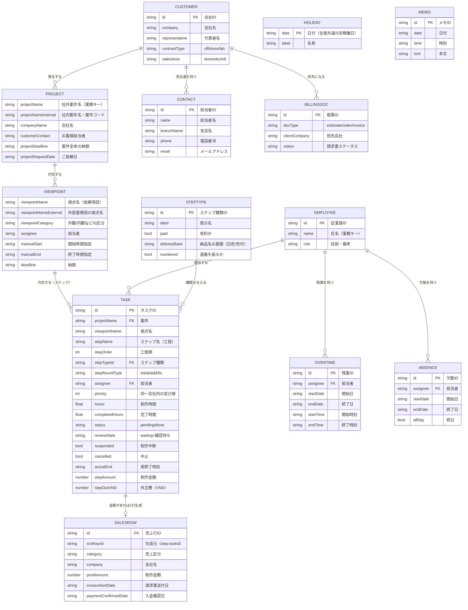

# ER図・データモデル設計書

| 項目 | 内容 |
|---|---|
| システム名称 | 工程図（koutei-zu） |
| 版数 | 2.0 |
| 作成日 | 2026-06-13 |
| 最終更新 | 2026-09-20（実装内容に合わせて全面改訂） |
| データストア | Google Cloud Firestore（ドキュメント指向NoSQL） |

---

## 1. 概要

本システムは関係データベースではなく **Firestore（NoSQL）** を採用している。
このため本書では以下の2層で表現する。

1. **論理データモデル（ER図）** … 業務エンティティの関係を論理的に表現（正規化された姿）。
2. **物理データモデル（Firestore構造）** … 実際の格納形態（コレクション／ドキュメント／非正規化）。

> 注意：Firestoreは非正規化前提のため、論理的な「子テーブル」が親ドキュメント内に配列で埋め込まれている箇所がある（マスタ系）。一方、タスク・帳票・売上（月別）は「1件=1ドキュメント」として格納している（同時編集耐性・サイズ上限対策のため）。

---

## 2. 論理データモデル（ER図）


```mermaid
erDiagram
    PROJECT ||--o{ VIEWPOINT : "内包する"
    VIEWPOINT ||--o{ TASK : "内包する（ステップ）"
    EMPLOYEE ||--o{ TASK : "担当する"
    EMPLOYEE ||--o{ OVERTIME : "残業を持つ"
    EMPLOYEE ||--o{ ABSENCE : "欠勤を持つ"
    CUSTOMER ||--o{ CONTACT : "担当者を持つ"
    CUSTOMER ||--o{ PROJECT : "発注する"
    STEPTYPE ||--o{ TASK : "種類を与える"
    TASK ||--o| SALESROW : "金額があれば1行生成"
    CUSTOMER ||--o{ BILLINGDOC : "宛先になる"

    PROJECT {
        string projectName "社外案件名（業務キー）"
        string projectNameInternal "社内案件名・案件コード"
        string companyName "会社名"
        string customerContact "お客様担当者"
        string projectDeadline "案件全体の納期"
        string projectRequestDate "ご依頼日"
    }
    VIEWPOINT {
        string viewpointName "視点名（依頼項目）"
        string viewpointNameExternal "外部連携用の視点名"
        string viewpointCategory "外観/内観などの区分"
        string assignee "担当者"
        string manualStart "開始時間指定"
        string manualEnd "終了時間指定"
        string deadline "納期"
    }
    TASK {
        string id PK "タスクID"
        string projectName FK "案件"
        string viewpointName "視点名"
        string stepName "ステップ名（工程）"
        int stepOrder "工程順"
        string stepTypeId FK "ステップ種類"
        string stepRoundType "initial/add/fix"
        string assignee FK "担当者"
        int priority "同一会社内の並び順"
        float hours "制作時間"
        float completedHours "完了時間"
        string status "pending/done"
        string reviewState "waiting=確認待ち"
        bool suspended "制作中断"
        bool cancelled "中止"
        string actualEnd "実終了時刻"
        number stepAmount "制作金額"
        number stepOutVND "外注費（VND）"
    }
    EMPLOYEE {
        string id PK "従業員ID"
        string name "氏名（業務キー）"
        string role "役割・備考"
    }
    CUSTOMER {
        string id PK "会社ID"
        string company "会社名"
        string representative "代表者名"
        string contractType "offshore/lab"
        string salesArea "domestic/intl"
    }
    CONTACT {
        string id PK "担当者ID"
        string name "担当者名"
        string branchName "支店名"
        string phone "電話番号"
        string email "メールアドレス"
    }
    STEPTYPE {
        string id PK "ステップ種類ID"
        string label "表示名"
        bool paid "有料か"
        string deliveryBase "納品名の基礎（白色/色付）"
        bool numbered "連番を振るか"
    }
    OVERTIME {
        string id PK "残業ID"
        string assignee FK "担当者"
        string startDate "開始日"
        string endDate "終了日"
        string startTime "開始時刻"
        string endTime "終了時刻"
    }
    ABSENCE {
        string id PK "欠勤ID"
        string assignee FK "担当者"
        string startDate "開始日"
        string endDate "終了日"
        bool allDay "終日"
    }
    HOLIDAY {
        string date PK "日付（全員共通の非稼働日）"
        string label "名称"
    }
    SALESROW {
        string id PK "売上行ID"
        string srcRound "生成元（step:taskId）"
        string category "売上区分"
        string company "会社名"
        number prodAmount "制作金額"
        string invoiceSentDate "請求書送付日"
        string paymentConfirmedDate "入金確認日"
    }
    BILLINGDOC {
        string id PK "帳票ID"
        string docType "estimate/order/invoice"
        string clientCompany "宛先会社"
        string status "請求書ステータス"
    }
    MEMO {
        string id PK "メモID"
        string date "日付"
        string time "時刻"
        string text "本文"
    }
```

> 補足：論理上「PROJECT」「VIEWPOINT」は独立エンティティだが、物理的には実体テーブルを持たず、TASK の属性（projectName / viewpointName 等）からアプリ側で動的に集約（グループ化）して再構成している。業務キーは `projectName`（案件）、`assignee::projectName::viewpointName`（視点）。

---

## 3. 物理データモデル（Firestore構造）

### 3.1 コレクション・ツリー

```
workspaces/{WORKSPACE_ID}/
├── tasks/{taskId}                 … タスク（1件=1ドキュメント）
└── data/{key}                     … 汎用KVストア（1キー=1ドキュメント）
        ├── settings               … 営業時間・残業・表示順・ポップアップ状態等の設定
        ├── holidays               … 全体共通の祝日（配列）※settingsから分離（巻き込み消失防止）
        ├── absences               … 欠勤・休日・不在（配列）※settingsから分離
        ├── customerMaster         … お客様マスタ（配列を value にJSON格納）
        ├── employeeMaster         … 従業員マスタ（配列を value にJSON格納）
        ├── stepTypeMaster         … ステップ種類マスタ（配列）
        ├── projectOrder           … 案件の手動並び順（配列）
        ├── memos                  … タスクメモ（配列）
        ├── deletedExternalIds     … 外部同期削除済みID（配列）
        ├── allowedEmails          … 許可メンバーのGmail（{ emails: [...] } 形式）
        ├── billingIssuer          … 自社情報・振込先（帳票の発行元）
        ├── deliveryCountSettings  … 制作枚数の締め日設定（{ cutoffDay }）
        ├── bill_{docId}           … 帳票（1件=1ドキュメント）
        ├── sales_{YYYY-MM}        … 売上登録表（1か月=1ドキュメント）
        ├── billingDocuments_backup … 旧・帳票集中保存の退避（移行後の保険）
        └── salesLedger_backup     … 旧・売上集中保存の退避（移行後の保険）
```

- `WORKSPACE_ID` … チーム共有の区切り（現在は `liebe-asia-team`）。同一IDで同一データを共有。
- `tasks` … タスクは独立ドキュメント。差分書き込み（変更分のみupsert）で同時編集に強い。
- `data` … 汎用KV。`{ value: <JSON文字列>, updatedAt }` を格納。
- `bill_` / `sales_` は `prefixStore()` で作られる同じ仕組みの派生ストア（`billingStore` / `salesStore`）。

> **移行済みの旧キー**：`tasks`（旧・全タスクを1ドキュメントに集中保存）は起動時に `tasks` サブコレクションへ取り込んだうえで削除される。`billingDocuments` / `salesLedger`（旧・集中保存）は `bill_` / `sales_` へ分割移行され、元データは `*_backup` キーへ退避される。

### 3.2 エンティティ定義

#### (1) Task（`tasks/{taskId}`）

タスクは「制作スケジュール」「請求・売上」「外部連携」の3系統の情報を1ドキュメントに持つ。

**［案件・視点の情報］**

| 物理名 | 型 | 必須 | 説明 |
|---|---|---|---|
| id | string | ○ | タスクID（`task-{timestamp}-{seq}-{rand}`）。ドキュメントIDと一致。 |
| projectName | string | ○ | 社外案件名（案件の業務キー）。 |
| projectNameInternal | string | | 社内案件名・案件コード。 |
| companyName | string | | 会社名。 |
| customerContact | string | | お客様担当者名。 |
| projectDeadline | string \| null | | 案件全体の納期（`YYYY-MM-DD`）。 |
| projectRequestDate | string \| null | | 案件のご依頼日。 |
| viewpointName | string | ○ | 視点名（依頼項目）。 |
| viewpointNameExternal | string | | 外部連携用の視点名（例：外観視点①_パターンA）。 |
| viewpointCategory | string | | 視点の区分（外観／内観など）。 |

**［ステップ・スケジュールの情報］**

| 物理名 | 型 | 必須 | 説明 |
|---|---|---|---|
| stepName | string \| null | | ステップ名（工程）。 |
| stepOrder | number \| null | | 視点内のステップ順（0始まり）。 |
| assignee | string | ○ | 制作担当者。 |
| priority | number | ○ | 同じ会社の中での並び順（小さいほど先）。既定は納期の早い順に自動挿入。 |
| hours | number | ○ | 制作時間（h）。 |
| completedHours | number | ○ | 完了時間（h）。既定0。 |
| memo | string | | メモ。 |
| tentative | boolean | | 仮案件フラグ。 |
| tentativeStart / tentativeEnd | string \| null | | 仮予定の期間。 |
| deadline | string \| null | | 納期（`YYYY-MM-DD`、視点単位）。 |
| manualStart | string \| null | | 開始時間指定（`YYYY-MM-DDTHH:mm`）。 |
| manualEnd | string \| null | | 終了時間指定（`YYYY-MM-DDTHH:mm`）。 |
| status | string | ○ | `pending` / `done`。 |
| completedAt | number \| null | | 完了時刻（epoch ms）。 |
| actualEnd | string \| null | | 実終了時刻（`YYYY-MM-DDTHH:mm`、完了時に記録）。後続の着手下限になる。 |
| registeredDate | string \| null | | 登録日（`YYYY-MM-DD`）。 |
| suspended | boolean \| null | | 制作中断フラグ（スケジュールから外すが再開可）。 |
| cancelled | boolean \| null | | 中止フラグ（実績は残すが後続スケジュールに影響させない）。 |
| delays | array \| undefined | | 遅延履歴 `[{ at, from, to }]`（epoch ms）。 |
| createdAt | number | ○ | 登録時刻（epoch ms）。並びが同列のときの順序にも使用。 |

**［確認待ち（完了後の確認フェーズ）］**

| 物理名 | 型 | 説明 |
|---|---|---|
| reviewState | string \| null | `'waiting'` のとき確認待ち。完了タブには出さない。 |
| reviewAt | number \| null | 確認待ちに入れた時刻（epoch ms）。 |
| reviewUpdatedAt | number \| null | 最終更新（修正メモ記入など）。3日でグレー・7日で自動完了の基準。 |
| reviewNote | string | 追加修正メモ。 |

**［請求・売上の情報］**

| 物理名 | 型 | 説明 |
|---|---|---|
| stepTypeId | string | ステップ種類ID（ステップ設定マスタの id）。 |
| stepRoundType | string | `initial`（初回）／`add`（追加）／`fix`（修正）。 |
| stepDeliverySuffix | string | 納品名の連番などの接尾語。 |
| stepDeliveryNameOverride | string | 納品名の手動上書き。 |
| stepAmount | number \| null | 制作金額（円）。 |
| stepRequestDate | string \| null | ステップのご依頼日（売上の計上月の基準）。 |
| stepCompletedDate | string \| null | ステップの納品日。 |
| stepOutInHouse | string | 社内の外注担当者名。 |
| stepOutExternal | string | 社外の外注先名。 |
| stepOutVND | number \| null | 外注費（ベトナムドン）。 |

**［外部連携］**

| 物理名 | 型 | 説明 |
|---|---|---|
| externalId | string \| undefined | 外部シート由来タスクの識別子（`案件コード::視点名::n回目::ステップ種類`）。 |
| migratedFromRound | string \| undefined | 旧 `prodHistory` からの移行で作られたステップの冪等キー。 |

#### (2) Settings（`data/settings`）

`value` に以下のオブジェクトをJSON文字列で格納。

| 物理名 | 型 | 説明 |
|---|---|---|
| morningStart / morningEnd | string | 午前の営業時間（既定 08:00 / 12:00）。 |
| afternoonStart / afternoonEnd | string | 午後の営業時間（既定 13:00 / 17:00）。 |
| startDate | string | スケジュール起点日（`YYYY-MM-DD`）。 |
| startTime | string | スケジュール起点時刻（既定 08:00）。 |
| overtimes | array | 残業（下記 Overtime）。 |
| endPromptState | object | 終了超過ポップアップ制御。キー=視点キー、値=`{ snoozedUntil, lastPromptedEnd }`。 |
| companyOrder | array(string) | 会社グループの表示順（既定：CG工房／リノべる株式会社／オフィスコム／田中建設／SUMUS／玉善／オフショア（その他））。 |

> **注意**：`absences`（欠勤）と `holidays`（祝日）は **settings の中ではなく独立キー**に保存する。以前は settings 内にあったが、settings の保存で巻き込み消失する事故を防ぐため分離した。起動時に旧 settings 内のデータを一度だけ独立キーへ移行する。

#### (3) Absence（`data/absences`）

| 物理名 | 型 | 説明 |
|---|---|---|
| id | string | 識別子（`abs-...`）。 |
| assignee | string | 対象担当者。 |
| startDate / endDate | string | 期間（`YYYY-MM-DD`）。 |
| allDay | boolean | 終日休みか。 |
| startTime / endTime | string | 時間帯不在の時刻（allDay=false時）。 |
| label | string | メモ（例：有給・午後休）。 |

#### (4) Overtime（`settings.overtimes[]`）

| 物理名 | 型 | 説明 |
|---|---|---|
| id | string | 識別子（`ot-...`）。 |
| assignee | string | 対象担当者。 |
| startDate / endDate | string | 期間（`YYYY-MM-DD`）。 |
| startTime / endTime | string | 残業時間帯（例 17:00〜19:00）。 |
| label | string | メモ（例：納期対応）。 |

#### (5) Holiday（`data/holidays`）

| 物理名 | 型 | 説明 |
|---|---|---|
| date | string | 開始日（`YYYY-MM-DD`）。 |
| days | number | 連続日数（テト休みなど複数日をまとめて登録できる）。 |
| label | string | 名称（例：テト、フンヴオン王の命日、臨時休業）。 |

> ベトナムの祝日は `VN_LUNAR_HOLIDAYS`（旧暦ベースの推定値）と固定祝日から候補を生成し、年を選んでまとめて登録する。政府発表で振替日が変わるため、登録値は毎年確認が必要。

#### (6) CustomerMaster（`data/customerMaster`）

`value` に会社の配列を格納。各会社は担当者（contacts）をネストで持つ。

| 物理名 | 型 | 説明 |
|---|---|---|
| id | string | 会社ID（`cust-...`）。 |
| company | string | 会社名。 |
| representative | string | 代表者名。 |
| phone / postalCode / address / websiteUrl | string | 連絡先情報。 |
| branchAddress1/2, branchPhone1/2 | string | 支店情報。 |
| contractType | string | 契約形態。`'offshore'` ならオフショア、未設定はラボ扱い。売上区分の判定に使う。 |
| salesArea | string | 売上エリア。`'intl'` なら国際、既定は国内。 |
| contacts | array | 担当者：`{ id, name, branchName, phone, email }`。 |

> 後方互換：旧フラット形式 `[{ id, company, contact }]` は読込時に会社単位へ正規化（`normalizeCustomerMaster`）。未知のフィールドは spread で保持する。

#### (7) EmployeeMaster（`data/employeeMaster`）

| 物理名 | 型 | 説明 |
|---|---|---|
| id | string | 従業員ID（`emp-...`）。 |
| name | string | 氏名（担当者の業務キー）。 |
| role | string | 役割・備考。配列の並び順＝担当者の表示順。 |

#### (8) StepTypeMaster（`data/stepTypeMaster`）

ステップの「種類」を定義するマスタ。未設定時は既定7種（ホワイト／カラー／人物＋添景合成／ホワイト修正（無料）／ホワイト変更（有料）／カラー修正（無料）／カラー変更（有料））を使う。

| 物理名 | 型 | 説明 |
|---|---|---|
| id | string | 種類ID（`white` / `color` / `white_fix` …）。 |
| label | string | 表示名。 |
| paid | boolean | 有料か（無料修正は売上に計上しない判断材料）。 |
| deliveryBase | string | 納品名の基礎（`白色` / `色付` など）。 |
| numbered | boolean | 納品名に連番を振るか（修正・変更で使う）。 |

#### (9) SalesLedger（`data/sales_{YYYY-MM}`）

1か月分の売上登録表を1ドキュメントで持つ。`value` に `{ rows: [...] , ... }` を格納。各行の主なフィールド：

| 物理名 | 型 | 説明 |
|---|---|---|
| id | string | 行ID。 |
| src / srcVp / srcRound | string | 自動生成行の出所。`srcRound = step:{taskId}`。手動行は未設定。 |
| category | string | 売上区分（`offshore_dom` / `offshore_intl` / `lab_dom` / `lab_intl`）。 |
| company / person / projectName | string | 会社・お客様担当・案件名。 |
| prodType / prodName | string | 制作種類・納品名。 |
| inHouseOutsourcer / externalOutsourcer | string | 社内外注・社外外注の担当者。 |
| outsourceVND | number | 外注費（ベトナムドン）。 |
| prodAmount | number | 制作金額（円）。 |
| sheets | number | 制作枚数。 |
| orderDate / dueDate / deliveryDate | string | ご依頼日・納期・納品日。 |
| completed | boolean | 完了チェック。 |
| invoiceSentDate / paymentConfirmedDate | string | 請求書送付日・入金確認日。 |
| billRound / billAmount / taxPayAmount | string/number | 請求回・請求額・税込支払額。 |
| hqStatus | string | 本社ステータス。 |
| note | string | 備考。 |

> 換算レート等の既定値：`exchangeRate = 165`（VND→円の除数）、`hqRate = 200`。

#### (10) BillingDocument（`data/bill_{docId}`）

帳票1件=1ドキュメント。種別は `estimate`（見積書）／`order`（発注書）／`invoice`（請求書）。
明細のほか、条件ページ・工程予定表ページ（固定7工程の列＋時間行）・アングルページを持つ。請求書はステータス（未送付／送付済み／入金済み）と日付を持つ。

発行元（自社情報・振込先）は帳票ごとではなく `data/billingIssuer` に1つだけ持ち、全帳票で共有する。

#### (11) Memo（`data/memos`）

| 物理名 | 型 | 説明 |
|---|---|---|
| id | string | メモID。 |
| date / time | string | 日付・時刻（時刻を入れるとブラウザ通知の対象になる）。 |
| text | string | 本文。 |
| color | string | 色（8色から選択）。 |
| notify | boolean | 通知するか。 |

#### (12) projectOrder / deletedExternalIds / allowedEmails（`data/*`）

- `projectOrder` … 案件名（社外案件名）の配列。手動ドラッグの並び順。会社を跨いだ移動を許容。
- `deletedExternalIds` … 外部シート由来タスクで削除済みの `externalId` 配列（再同期での復活防止）。
- `allowedEmails` … `{ emails: [...] }`。許可メンバーのGmail。書き換えはオーナーのみ（ルールで制限）。

---

## 4. 主キー・業務キー・関連

| エンティティ | 主キー | 業務キー | 主な関連 |
|---|---|---|---|
| Task | id（ドキュメントID） | projectName + viewpointName + stepOrder | 案件・視点・担当者をフィールド参照（非正規化）。 |
| Project（論理） | — | projectName | Taskから動的集約。 |
| Viewpoint（論理） | — | assignee::projectName::viewpointName | Taskから動的集約。 |
| Employee | id | name | Task.assignee と name で照合。 |
| Customer | id | company | Task.companyName と company で照合。 |
| Contact | id | name | Customer内にネスト。 |
| StepType | id | id | Task.stepTypeId と照合。 |
| SalesRow | id | srcRound（`step:{taskId}`） | Task から自動生成。手動行は業務キーを持たない。 |
| BillingDocument | id（`bill_{id}`） | — | 宛先会社名で Customer と緩く結びつく。 |

> 参照整合性はDB制約ではなくアプリ側で担保（名称変更時はTask群へ波及更新＝`needsRename`処理）。

---

## 5. インデックス・整合性に関する留意点

- Firestoreのため複合インデックスは未使用（全件購読してクライアント側でソート・集約）。
- 並び替えはクライアントで正規化（`normalizePriorities`：会社ごとに1..nへ再採番）。
- 同時編集対策：タスクの保存は「前回スナップショットとの差分のみupsert」（ローカルに無いタスクを誤って削除しない）。
- 一括書き込みは450件ごとに分割（Firestoreのバッチ500件上限対策）。
- ドキュメント1MB上限：帳票・売上を1件／1か月ごとに分割したのはこの上限対策。見積書への画像貼り付けが未実装なのも同じ理由（`docs/06` 項目4）。
- 売上の自動同期は「source が所有するフィールドのみ上書き」「手動行には触れない」を不変条件とする。

---

## 6. セキュリティ（Firestoreルール）

実際の `firestore.rules` は「オーナー（ルール内に直書き）」＋「`data/allowedEmails` の emails 配列に載っているメンバー」の2段構えになっている。

```
function isOwner() {
  return request.auth != null
    && request.auth.token.email_verified == true
    && request.auth.token.email in ['<オーナーのメール>'];
}
function isMember(workspaceId) {
  return request.auth != null
    && request.auth.token.email_verified == true
    && request.auth.token.email in
       get(/databases/$(database)/documents/workspaces/$(workspaceId)/data/allowedEmails).data.emails;
}

match /workspaces/{workspaceId}/data/allowedEmails {
  allow read: if isOwner() || isMember(workspaceId);
  allow write: if isOwner();            // 許可リストの書き換えはオーナーのみ
}
match /workspaces/{workspaceId}/data/{docKey} {
  allow read, write: if isOwner() || isMember(workspaceId);
}
match /workspaces/{workspaceId}/data/{docKey}/{rest=**} {
  allow read, write: if isOwner() || isMember(workspaceId);
}
match /workspaces/{workspaceId}/tasks/{taskId} {
  allow read, write: if isOwner() || isMember(workspaceId);
}
```

- 検証済み（email_verified）のGoogleアカウントのみ。非許可ユーザーはアプリ側でも自動サインアウトする。
- ルール内のオーナーメールと `src/firebase.js` の `OWNER_EMAILS` は**必ず同じ値を保つ**（ロックアウト防止の二重化）。
- **ルールを変更したら Firebase コンソールへ手動デプロイが必要**（リポジトリへのコミットだけでは有効にならない）。
- スプレッドシート連携（Apps Script → Firestore REST API）はサービスアカウント／オーナーのOAuthトークンで書き込むため、このルールの適用外。
