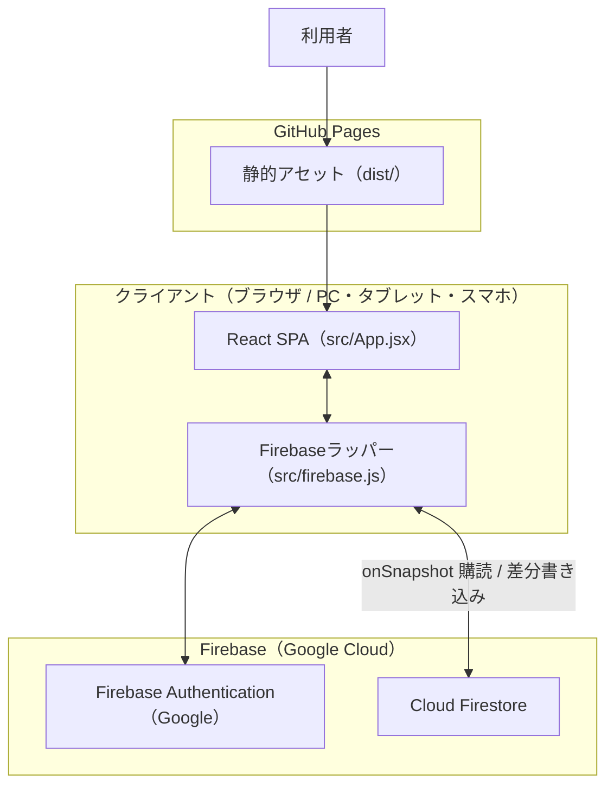
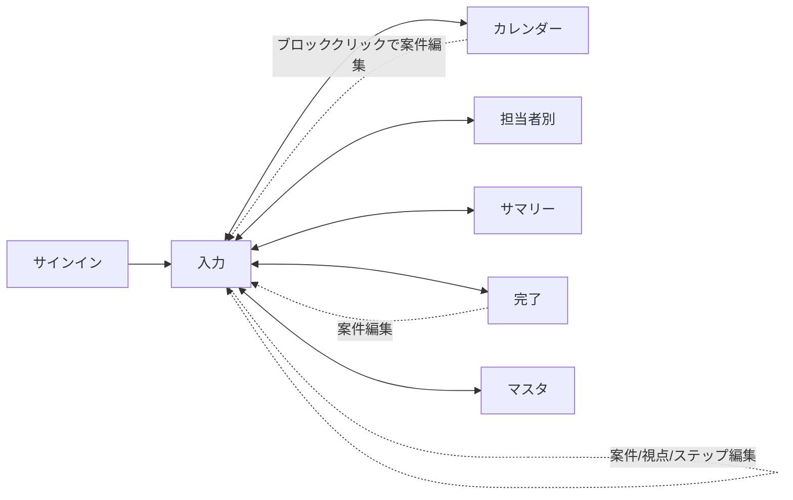

# 基本設計書

| 項目 | 内容 |
|---|---|
| システム名称 | 工程図（koutei-zu） |
| 版数 | 1.0 |
| 作成日 | 2026-06-13 |

---

## 1. システム構成

### 1.1 アーキテクチャ概要

クライアントサイドのみで完結するSPA（Single Page Application）。バックエンドはFirebaseのマネージドサービスを利用し、専用のアプリケーションサーバを持たない「サーバレス構成」とする。

### 1.2 技術スタック

| 層 | 採用技術 |
|---|---|
| フレームワーク | React 18 |
| ビルド | Vite 5 |
| 言語 | JavaScript / JSX（TypeScript不使用） |
| スタイル | インラインスタイル（CSSフレームワーク不使用） |
| アイコン | lucide-react |
| 認証 | Firebase Authentication（Googleプロバイダ） |
| データベース | Cloud Firestore（database id: `default`、memoryLocalCache） |
| ホスティング | GitHub Pages（`gh-pages` で `dist/` を公開） |
| 外部連携（任意） | Google Apps Script（`sync/Code.gs`、シート同期） |

### 1.3 デプロイ構成

- `npm run build`（vite build）→ `dist/` 生成。
- `npm run deploy`（build → `gh-pages -d dist`）で GitHub Pages へ公開。
- ソース（main ブランチ）への push と gh-pages へのデプロイは必ずセットで運用する。

---

## 2. 画面設計（機能配置）

### 2.1 画面一覧（ナビゲーション）

| 画面ID | 画面名 | コンポーネント | 主な役割 |
|---|---|---|---|
| V-INPUT | 入力 | `InputView` | 案件登録フォーム＋進行中タスク一覧。 |
| V-CAL | カレンダー | `CalendarView` | 担当者×日付のタイムライン（1日/週間/月間/全期間）。 |
| V-ASG | 担当者別 | `AssigneeView` | 担当者ごとの視点グループ。 |
| V-MSG | サマリー | `MessageView` | 会社別連絡文・担当者メッセージ・進捗集計。 |
| V-DONE | 完了 | `DoneView` | 完了タスク一覧（日付別・検索・実績編集）。 |
| V-MST | マスタ | `MasterView` | お客様/従業員マスタ・残業・欠勤・会社表示順。 |

### 2.2 共通レイアウト

- ヘッダー：タイトル、ナビゲーションボタン群、設定（⚙）、サインアウト。
- 設定（⚙）：開始日時・午前/午後の営業時間。残業・欠勤・表示順はマスタ画面へ集約。
- 認証前：Googleサインイン画面。非許可メールは拒否メッセージを表示。

### 2.3 画面遷移

---

## 3. 機能設計

### 3.1 認証機能（F-01）

- Googleポップアップサインイン。`ALLOWED_EMAILS` に含まれる検証済みメールのみ許可。
- 非許可メールはサインイン直後に自動サインアウトし、拒否メッセージを表示。
- 認証状態は `subscribeAuth` で購読し、`{ user, allowed, ready }` を管理。

### 3.2 データ同期機能

- タスクは `tasksStore.subscribe`（onSnapshot）でリアルタイム購読。
- 設定・マスタ・並び順は `storage.subscribe`（キー単位のonSnapshot）で購読。
- 保存は楽観的更新（画面即時反映）→ Firestore書き込み → 他端末へ同期。
- タスク保存は差分のみ（前回スナップショットと比較し変更分のみupsert）。

### 3.3 スケジューリング機能（F-05〜F-08）

#### 3.3.1 稼働時間モデル
- 1日の稼働＝午前スロット＋午後スロット。土日除外、第2・第4土曜は午前のみ。
- 残業（overtimes）は該当担当者・該当日の稼働枠にマージ。
- 欠勤（absences）は該当時間帯を稼働枠から減算。

#### 3.3.2 作業順の決定
1. 案件の並び順（既定は会社ごと、手動ドラッグで会社跨ぎ可）
2. 案件内の優先順位（priority）
3. ホワイト工程を全視点で優先
4. 登録順（createdAt）

#### 3.3.3 配置アルゴリズム（概要）
- 開始時間指定タスクを事前に枠予約（差し込み）。
- 指定なしタスクは担当者ごとに「直前タスクの終了時刻」から空き枠へ順に充填。
- 終了時間指定があればその時刻で打ち切り、後続はその時刻以降に開始。
- 同視点の工程順（前ステップの終了時刻）を下限として常に守る。

#### 3.3.4 進捗連動の終了予定調整（F-08）
- 開始が現在より過去のタスクは「経過稼働時間＋残作業時間」で実効所要を算出して枠を取り直す。
- 完了時間の増減に応じて終了見込みが前後し、1分ごとに再計算する。

### 3.4 進捗管理機能（F-11, F-12）

- 完了時間：行内の +0.5h / +1h、任意値入力、数値直接編集で加算。完了時間≧制作時間で自動完了。
- 進捗はリアルタイム表示：視点カードの「経過」バー（薄色）が現在時刻ベースの想定進捗、実績（濃色）は手動入力。`now` は 60 秒ごとに更新。経過自動加算（AdvanceBar）は廃止。

### 3.5 完了・通知機能（F-13, F-14）

- 視点完了／案件完了：終了時刻（実績）を入力するダイアログを経て done 化。中止も可能。
- 終了超過ポップアップ：視点単位で終了予定超過を検知し、完了/追加修正/遅延/後で を提示。
  - 遅延時は終了時間指定を新しい時刻へ更新し、差分稼働時間を加算（再表示ループを防止）。

### 3.6 表示・連絡機能（F-15〜F-19）

- カレンダー：担当者を行、日付を列としたタイムライン。案件色はパステル、ホワイト工程は淡色。完了/中止/休日/不在をグレー表示。ドラッグで案件順・担当者順を変更可能。
- 進行中タスク一覧：納期順／会社別／担当者別の切替、検索、ドラッグ/↑↓での並び替え、視点カードの階段状インデント表示。
- サマリー：会社別業務連絡文（挨拶文形式）・担当者別メッセージをクリップボード生成。

### 3.7 マスタ管理機能（F-20〜F-22）

- お客様マスタ：会社＋担当者（連絡先）。案件入力の候補に反映。
- 従業員マスタ：担当者。並び順＝カレンダー等の表示順。
- 残業・欠勤・会社表示順設定もマスタ画面に集約。

---

## 4. 外部インターフェース設計

| I/F | 方向 | 概要 |
|---|---|---|
| Firebase Auth | 双方向 | Googleサインイン／状態購読。 |
| Cloud Firestore | 双方向 | タスク・設定・マスタの購読／書き込み。 |
| Google Apps Script（任意） | 取込 | 外部スプレッドシートからのタスク同期（`externalId`で識別）。 |
| クリップボード | 出力 | 連絡文・メッセージのコピー。 |

---

## 5. 非機能設計

| 項目 | 設計方針 |
|---|---|
| 性能 | 全件購読＋クライアント計算。`useMemo` でスケジュール再計算を最適化。 |
| 同時編集 | 1タスク=1ドキュメント＋差分書き込みで端末間の乖離を防止。 |
| 可用性 | マネージドサービス依存。memoryLocalCacheで毎回サーバ取得し整合性を優先。 |
| セキュリティ | Firestoreルールで許可メール（検証済み）限定。フロントでも二重チェック。 |
| 保守性 | 純粋ロジック（スケジューラ等）を関数として切り出し、Nodeで単体検証可能。 |
| レスポンシブ | 480px/380pxブレークポイント、PCはドラッグ・スマホは↑↓ボタンの二系統操作。 |

---

## 6. 運用・保守設計

- ビルド検証：`npm run build` が警告・エラーなく通ること。
- デプロイ：`npm run deploy` 後、main への push をセットで実施。
- データ移行：旧1ドキュメント保存（`data/tasks`）から `tasks` サブコレクションへ自動移行ロジックを内蔵。
- マスタ後方互換：お客様マスタの旧フラット形式を読込時に自動正規化。
