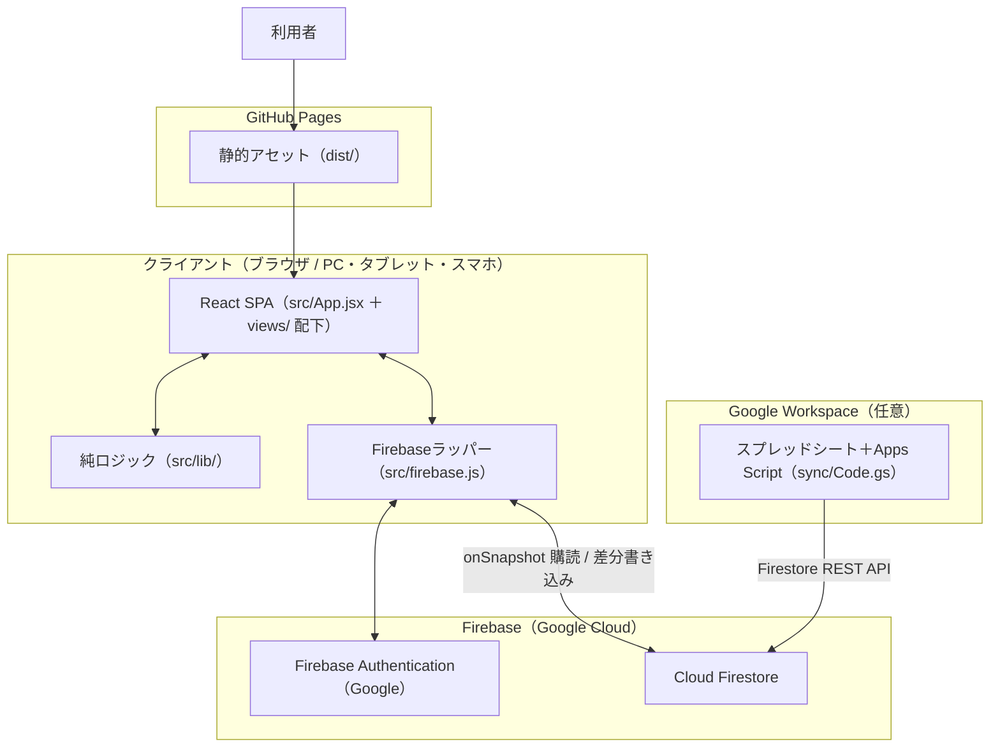
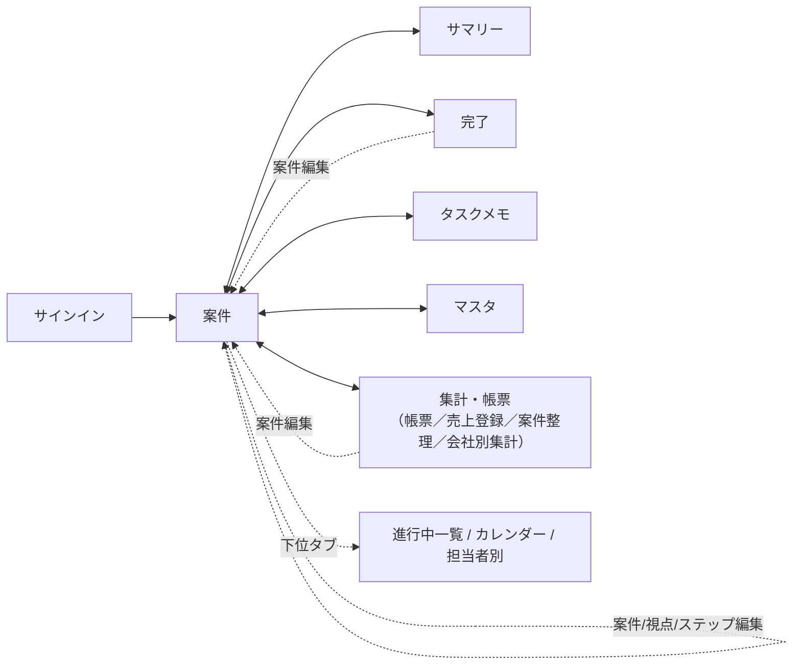

# 基本設計書

| 項目 | 内容 |
|---|---|
| システム名称 | 工程図（koutei-zu） |
| 版数 | 2.0 |
| 作成日 | 2026-06-13 |
| 最終更新 | 2026-09-20（実装内容に合わせて全面改訂） |

---

## 1. システム構成

### 1.1 アーキテクチャ概要

クライアントサイドのみで完結するSPA（Single Page Application）。バックエンドはFirebaseのマネージドサービスを利用し、専用のアプリケーションサーバを持たない「サーバレス構成」とする。


```mermaid
flowchart TB
    subgraph Client["クライアント（ブラウザ / PC・タブレット・スマホ）"]
        UI["React SPA（src/App.jsx ＋ views/ 配下）"]
        LIB["純ロジック（src/lib/）"]
        FW["Firebaseラッパー（src/firebase.js）"]
        UI <--> LIB
        UI <--> FW
    end
    subgraph GH["GitHub Pages"]
        Static["静的アセット（dist/）"]
    end
    subgraph FB["Firebase（Google Cloud）"]
        Auth["Firebase Authentication（Google）"]
        FS["Cloud Firestore"]
    end
    subgraph GAS["Google Workspace（任意）"]
        Sheet["スプレッドシート＋Apps Script（sync/Code.gs）"]
    end
    Browser["利用者"] --> Static
    Static --> UI
    FW <--> Auth
    FW <-->|"onSnapshot 購読 / 差分書き込み"| FS
    Sheet -->|"Firestore REST API"| FS
```

### 1.2 技術スタック

| 層 | 採用技術 |
|---|---|
| フレームワーク | React 18（`React.lazy` による画面の遅延読み込み） |
| ビルド | Vite 5 |
| 言語 | JavaScript / JSX（TypeScript不使用） |
| スタイル | インラインスタイル（CSSフレームワーク不使用） |
| アイコン | lucide-react |
| 静的解析 | ESLint 9（フラット構成 `eslint.config.js`）。`npm run build` の前に自動実行 |
| 認証 | Firebase Authentication（Googleプロバイダ） |
| データベース | Cloud Firestore（database id: `default`、memoryLocalCache） |
| ホスティング | GitHub Pages（`gh-pages` で `dist/` を公開） |
| 外部連携（任意） | Google Apps Script（`sync/Code.gs`、シート同期。Firestore REST API で書き込み） |

### 1.3 ソース構成

2026-07 に App.jsx（約1万行の単一ファイル）を機能ごとに分割した。

```
src/
  App.jsx            # 状態管理・Firestore購読・タスク操作ハンドラ・画面切替
  appContext.js      # AppCtx / useApp()：共有データ＋ハンドラをビューへ渡すコンテキスト
  firebase.js        # Firebase初期化・認証・tasksStore / storage / billingStore / salesStore
  lib/
    utils.js         # 日付・時刻・色・プリセット・稼働枠・祝日など純ユーティリティ
    schedule.js      # スケジューラ・マイグレーション・並び順・視点グループ化（純ロジック）
  components/
    common.jsx       # 共通UI部品（モーダル・トースト・TimeSelect・DateTimeField・NavButton 等）
    modals.jsx       # 過去案件引用・終了予定超過ポップアップ
    MemberSettings.jsx
  views/             # 画面単位（案件=InputView・サマリー・完了・マスタ・メモ・カレンダー・担当者別）
    input/           # 案件タブの下位部品（一覧・視点カード・ステップ行・各セクション）
  billing/           # 帳票（見積・発注・請求）
  sales/             # 売上登録表・会社別集計
  project/           # 案件整理表
  viewpoint/         # 視点・ステップのロジック、売上自動同期
```

**ファイル分割の維持ルール**：1ファイル 1800 行まで（App.jsx のみ 2600）。超える前に分割する（ESLintで強制）。共有データ・ハンドラは `useApp()` から取得し、props のバケツリレーに戻さない。詳細は `docs/07_UI設計原則.md`。

### 1.4 デプロイ構成

- `npm run check`（ESLint）→ `npm run build`（vite build。prebuild で check を自動実行）→ `dist/` 生成。
- `npm run deploy`（build → `gh-pages -d dist`）で GitHub Pages へ公開。
- ソース（main ブランチ）への push と gh-pages へのデプロイは必ずセットで運用する。
- Firestoreルール（`firestore.rules`）の変更は、Firebaseコンソールへの**手動デプロイ**が別途必要。

---

## 2. 画面設計（機能配置）

### 2.1 画面一覧（ナビゲーション）

ナビは「毎日使うタブ（直接表示）」と「集計・帳票（ドロップダウン）」の2段構成。新しいトップレベルビューを増やす場合は集計・帳票グループへ入れる（`docs/07`）。

**［直接表示タブ］**

| 画面ID | 画面名 | コンポーネント | 主な役割 |
|---|---|---|---|
| V-INPUT | 案件 | `InputView` | 案件登録フォーム＋進行中一覧／カレンダー／担当者別（下位タブ）。 |
| V-MSG | サマリー | `MessageView` | 会社別連絡文（朝／夕）・今週の予定。 |
| V-DONE | 完了 | `DoneView` | 完了タスク一覧（日付別・検索・実績編集）＋視点別修正集計。 |
| V-MEMO | タスクメモ | `MemoView` | 日付・時刻つきメモ（カレンダー風）。 |
| V-MST | マスタ | `MasterView` | お客様／従業員／ステップ設定／会社の表示順／ベトナムの祝日。 |

**［「集計・帳票」グループ］**

| 画面ID | 画面名 | コンポーネント | 主な役割 |
|---|---|---|---|
| V-BILL | 帳票 | `BillingView` | 見積書・発注書・請求書の作成／複製／印刷。 |
| V-SALES | 売上登録 | `SalesView` | 月別の売上登録表・月次集計・外注費・請求/入金チェック。 |
| V-PSHEET | 案件整理 | `ProjectSheetView` | 案件一覧（清算月・ご依頼日・納品日をその場で編集）。 |
| V-CSUM | 会社別集計 | `CompanySummaryView` | 会社別／担当者別／制作種類別の集計。 |

**［案件タブの下位タブ］**

| ID | 名称 | 内容 |
|---|---|---|
| T-LIST | 進行中一覧 | 視点カードの一覧（納期順／会社別／担当者別の切替）。 |
| T-CAL | カレンダー | 担当者×日付のタイムライン（1日／全期間）。 |
| T-ASG | 担当者別 | 担当者ごとの視点グループ。 |

> 旧版では「カレンダー」「担当者別」がトップレベルの独立画面だったが、現在は案件タブの下位タブに統合されている。旧「入力」タブは「案件」に改称。

### 2.2 共通レイアウト

- ヘッダー：タイトル、ナビゲーションボタン群、「集計・帳票」ドロップダウン、データ更新ボタン、設定（⚙）、サインアウト。
- 設定（⚙）パネル：開始日時・午前/午後の営業時間・メンバー管理。残業・欠勤はマスタ画面へ集約済み（案内のみ表示）。
- 認証前：Googleサインイン画面。非許可メールは拒否メッセージを表示。
- 画面の読み込み中は `Suspense` のフォールバック（「読み込み中...」）を表示する。

### 2.3 画面遷移


```mermaid
flowchart LR
    Login["サインイン"] --> Input["案件"]
    Input <--> Summary["サマリー"]
    Input <--> Done["完了"]
    Input <--> Memo["タスクメモ"]
    Input <--> Master["マスタ"]
    Input <--> Reports["集計・帳票<br/>（帳票／売上登録／案件整理／会社別集計）"]
    Input -.->|"案件/視点/ステップ編集"| Input
    Input -.->|"下位タブ"| Sub["進行中一覧 / カレンダー / 担当者別"]
    Done -.->|"案件編集"| Input
    Reports -.->|"案件編集"| Input
```

---

## 3. 機能設計

### 3.1 認証機能（F-01, F-37）

- Googleポップアップサインイン（`signIn()`）。
- 許可判定は2段構え。
  1. `OWNER_EMAILS`（`src/firebase.js` に直書きのオーナー）
  2. `workspaces/{wid}/data/allowedEmails` の `emails` 配列に載っているメンバー
- いずれにも該当しない検証済みメールは、サインイン直後に自動サインアウトし拒否メッセージを表示する。
- 認証状態は `subscribeAuth` で購読し、`{ user, allowed, ready }` を管理。`user.isOwner` でオーナー限定UI（メンバー編集）を出し分ける。
- メンバー管理UI（`MemberSettings`）は設定パネル内。追加・削除はオーナーのみ。

### 3.2 データ同期機能

- タスクは `tasksStore.subscribe`（onSnapshot）でリアルタイム購読。
- 設定・マスタ・並び順・メモは `storage.subscribe`（キー単位のonSnapshot）で購読。
- 帳票・売上は `billingStore` / `salesStore`（`prefixStore` 派生）で、1件／1か月ごとに読み書き。
- 保存は楽観的更新（画面即時反映）→ Firestore書き込み → 他端末へ同期。
- タスク保存は差分のみ（前回スナップショットと比較し変更分のみupsert）。一括は450件ごとに分割。
- 「データ更新」ボタンで手動再取得できる（アプリ更新直後にタスクが一時的に消えて見える場合の復旧用）。

#### 起動時の自動データ移行

| 移行 | 内容 |
|---|---|
| 旧 `data/tasks` → `tasks` サブコレクション | サブコレクションが空のときだけ取り込み、旧キーを削除。 |
| 旧 settings 内の `holidays` / `absences` → 独立キー | 独立キーが未作成のときだけ一度移行。以後 settings 側の旧データでは上書きしない。 |
| 旧 `billingDocuments` → `bill_{id}` | 分割保存へ移行し、元データを `billingDocuments_backup` へ退避してから元キーを削除。 |
| 旧 `salesLedger` → `sales_{YYYY-MM}` | 同上（`salesLedger_backup` へ退避）。 |
| 旧 `prodHistory` → ステップ | 制作履歴をステップ（請求の元データ）へ変換。非破壊（prodHistory は残す）・冪等（`migratedFromRound` で二重生成を防止）・一度きり。 |

### 3.3 スケジューリング機能（F-05〜F-08）

#### 3.3.1 稼働時間モデル
- 1日の稼働＝午前スロット＋午後スロット。土日除外、第2・第4土曜は午前のみ。
- 登録された**祝日は終日非稼働**（`data/holidays`、ベトナムの祝日を含む）。
- 残業（`settings.overtimes`）は該当担当者・該当日の稼働枠にマージ。
- 欠勤（`data/absences`）は該当時間帯を稼働枠から減算。
- 稼働時間は現時点で**全員共通**（担当者ごとの時差設定は未実装）。

#### 3.3.2 作業順の決定
1. 案件の並び順（既定は会社ごと、手動ドラッグで会社跨ぎ可）
2. 案件内の並び順（`priority`）
3. ホワイト工程を全視点で優先
4. 登録順（`createdAt`）

> **優先順位の人手採番は廃止**。新規登録時は `deadlineInsertPriority()` により「同じ会社の中で納期（実効）の早い順」の位置へ自動挿入される。編集時は既存の並びを保持する。並びは後からドラッグ・↑↓で変更できる。

#### 3.3.3 配置アルゴリズム（概要）
- `active`（進行中）／`done`（完了）／`suspended`（制作中断）に分離し、中断はスケジュール対象外。
- 開始時間指定タスクを事前に枠予約（差し込み）。
- 指定なしタスクは担当者ごとに「直前タスクの終了時刻」から空き枠へ順に充填。
- 終了時間指定があればその時刻で打ち切り、後続はその時刻以降に開始。
- 同視点の工程順（前ステップの終了時刻）を下限として常に守る。
- 完了実績（`actualEnd`）から算出した `doneFloor` を担当者ごとの着手下限にする。

#### 3.3.4 進捗連動の終了予定調整（F-08）
- 所要時間は **残作業（制作時間 − 完了時間）のみ**。経過時間では枠を膨張させない。
- 完了時間を入力しないまま時間が経っても、終了予定は後ろにずれない。0.5hのタスクは常に0.5h枠。
- 遅れが後続に伝わるのは「完了時に実終了時刻（actualEnd）を入力したとき」だけ（`doneFloor` 経由）。
- 画面は1分ごとに再計算する。

### 3.4 進捗管理・警告機能（F-11, F-12, F-27〜F-29）

- 完了時間：行内の +0.5h / +1h、任意値入力、数値直接編集で加算。完了時間≧制作時間で自動完了。
- 経過進捗の可視化：視点カードの「経過」バー（薄色）が現在時刻ベースの想定進捗、実績（濃色）は手動入力。`now` は60秒ごとに更新。**経過自動加算（旧 AdvanceBar）は廃止**。
- 予測遅延（`computeLateRisks`）：納期に間に合わない見込みの視点を一覧上部に警告表示。非表示にした警告は `localStorage`（`kz-riskMute` / `kz-lateRiskMute`）で端末ごとに記憶する。
- 空き時間サマリー（`computeFreeHours`）：担当者ごとの空き稼働時間を表示。
- おすすめ担当者：登録前に担当者を変えた場合の終了予定を試算し、早く終わる候補を提案する。

### 3.5 完了・確認待ち・通知機能（F-13, F-14, F-25, F-26）

- 視点完了／案件完了：実終了時刻を入力するダイアログを経て `status: done` にしたうえ、**まず「確認待ち」**（`reviewState: 'waiting'`）へ入る。完了タブには出さない。
- 確認待ち：追加修正メモを記入でき、記入すると期限がリセットされる（`reviewUpdatedAt`）。3日更新がなければグレー表示、**7日で自動的に完了タブへ移る**。「進行中へ戻す」で復帰できる。
- 制作中断（suspended）：納品後の確認待ちなどで進行できない案件を一旦スケジュールから外す。「制作再開」で戻せる。
- 中止（cancelled）：実績は残すが後続スケジュールに影響させない。
- 終了超過ポップアップ：視点単位で終了予定超過を検知し、完了/追加修正/遅延/後で を提示。
  - 遅延時は終了時間指定を新しい時刻へ更新し、差分稼働時間を加算（再表示ループを防止）。

### 3.6 表示・連絡機能（F-15〜F-19）

- カレンダー：担当者を行、日付を列としたタイムライン。案件色はパステル、ホワイト工程は淡色。完了/中止/休日/不在/祝日をグレー表示。ドラッグで案件順・担当者順を変更可能。
- 進行中タスク一覧：納期順／会社別／担当者別の切替、検索、ドラッグ/↑↓での並び替え、視点カードの階段状インデント表示。上部に予測遅延・空き時間のセクション、制作中断・確認待ちのセクションを持つ。
- サマリー：会社別業務連絡文（「業務開始（朝）」「業務終了（夕）」の2モード）と今週の予定（担当者別）をクリップボード生成。案件がなくても常に表示する会社（TAMAZEN・SUMUS）を持つ。

### 3.7 売上・帳票・集計機能（F-30〜F-34）

- **売上登録表**：月を選んで編集。1か月＝1ドキュメント。区分（オフショア/ラボ × 国内/国際）別の月次集計、外注費集計、制作枚数（締め日設定つき）、請求・入金チェックのカードを持つ。
- **ステップ→売上の自動同期**（`src/viewpoint/salesSync.js`）：金額の入ったステップから1ステップ＝1行を生成。`srcRound = step:{taskId}` で識別し、手動行には触れない。source 所有フィールドのみ上書きし、ユーザー編集項目は保持する。ステップから金額を消すと行も消える。
- **帳票**：見積書／発注書／請求書。明細ページに加えて条件ページ・工程予定表ページ（固定7工程）・アングルページを持つ。発行元（自社情報・振込先）は `data/billingIssuer` に1つだけ持ち全帳票で共有。請求書はステータス（未送付／送付済み／入金済み）を持つ。
- **案件整理表**：番号・会社名・社内案件名・案件名・担当者名・制作状況・カット名・清算月・ご依頼日・納品日の一覧。清算月／ご依頼日／納品日はその場で編集できる。
- **会社別集計**：会社別／担当者別／制作種類別の集計。締め日設定は売上登録表と共有（`deliveryCountSettings`）。

### 3.8 マスタ管理機能（F-20〜F-24）

マスタ画面は5つのタブで構成する。

| タブ | 内容 |
|---|---|
| お客様設定 | 会社＋担当者（連絡先）。契約形態（オフショア/ラボ）・売上区分（国内/国際）も設定。案件入力の候補に反映。 |
| 従業員設定 | 担当者。並び順＝カレンダー等の表示順。 |
| ステップ設定 | ステップ種類（表示名・有料/無料・納品名の基礎・連番の有無）。 |
| 会社の表示順 | 一覧・カレンダーでの会社グループの並び順。 |
| ベトナムの祝日 | 年を選んで候補を一括登録。任意の臨時休業日も手動登録できる。 |

残業（`OvertimeManager`）・欠勤（`AbsenceManager`）の登録UIも同画面に置く。

### 3.9 タスクメモ機能（F-35）

- 日付・時刻・本文・色を持つメモ。カレンダー風に日付ごとに表示。
- 時刻を設定したメモは、**アプリを開いている間だけ** ブラウザの `Notification` API とアプリ内バナーで通知する。タブを閉じている間は通知できない（`docs/06` 項目9）。

---

## 4. 外部インターフェース設計

| I/F | 方向 | 概要 |
|---|---|---|
| Firebase Auth | 双方向 | Googleサインイン／状態購読。 |
| Cloud Firestore | 双方向 | タスク・設定・マスタ・帳票・売上の購読／書き込み。 |
| Google Apps Script（任意） | 取込 | スプレッドシートからタスクを同期（Firestore REST API・`externalId` で識別）。 |
| クリップボード | 出力 | 連絡文・メッセージのコピー。 |
| ブラウザ通知（Notification API） | 出力 | タスクメモの時刻通知（アプリを開いている間のみ）。 |
| 印刷（ブラウザ） | 出力 | 帳票の印刷／PDF保存。 |

---

## 5. 非機能設計

| 項目 | 設計方針 |
|---|---|
| 性能 | 全件購読＋クライアント計算。`useMemo` でスケジュール再計算を最適化。使用頻度の低いビューは `React.lazy` で遅延読み込み。 |
| 同時編集 | 1タスク=1ドキュメント＋差分書き込みで端末間の乖離を防止。帳票は1件、売上は1か月ごとに分割。 |
| 可用性 | マネージドサービス依存。memoryLocalCacheで毎回サーバ取得し整合性を優先。 |
| セキュリティ | Firestoreルールでオーナー＋許可メンバー（検証済み）限定。フロントでも二重チェック。 |
| 保守性 | 純粋ロジック（スケジューラ等）を `src/lib/` に切り出し、Nodeで単体検証可能。ファイル行数上限をESLintで強制。 |
| UI品質 | `docs/07_UI設計原則.md` の10原則（ネイティブダイアログ禁止・段階的開示・モードレスなど）を主要項目までESLintで強制。 |
| レスポンシブ | 480px/380pxブレークポイント、PCはドラッグ・スマホは↑↓ボタンの二系統操作。 |

---

## 6. 運用・保守設計

- **修正のたびのワンセット運用**（`CLAUDE.md` に明記）
  1. `npm run build` が警告・エラーなく通ることを確認（prebuild で ESLint が走る）
  2. `npm run deploy` でデプロイ
  3. 未コミット・未プッシュの変更をすべてコミットして `git push origin main`
- デプロイ（gh-pages）と main への push は必ずセット。片方を忘れるとGitHubのソースが古いまま乖離する。
- 取りこぼし防止として、`.claude/settings.json` の Stop フック（`.claude/hooks/deploy-on-stop.sh`）がターン終了時に自動デプロイ＋pushを行う（main ブランチで未コミット変更がない場合のみ）。
- データ移行ロジックは起動時に自動実行（3.2 参照）。旧データのバックアップキー削除は現状 Firebase コンソールからの手作業（`docs/06` 項目7）。
- マスタ後方互換：お客様マスタの旧フラット形式を読込時に自動正規化。
- Firestoreルールを変更したら Firebase コンソールへ手動デプロイする。
