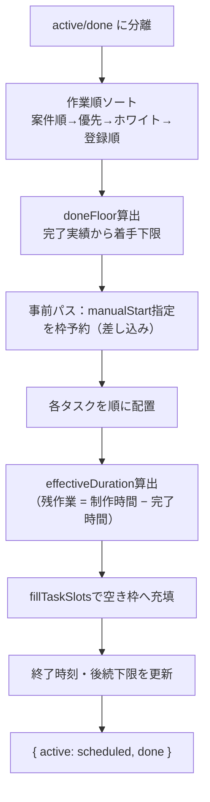
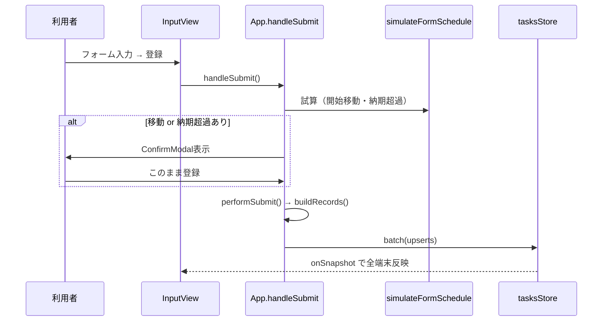
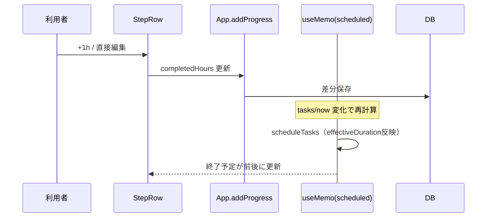
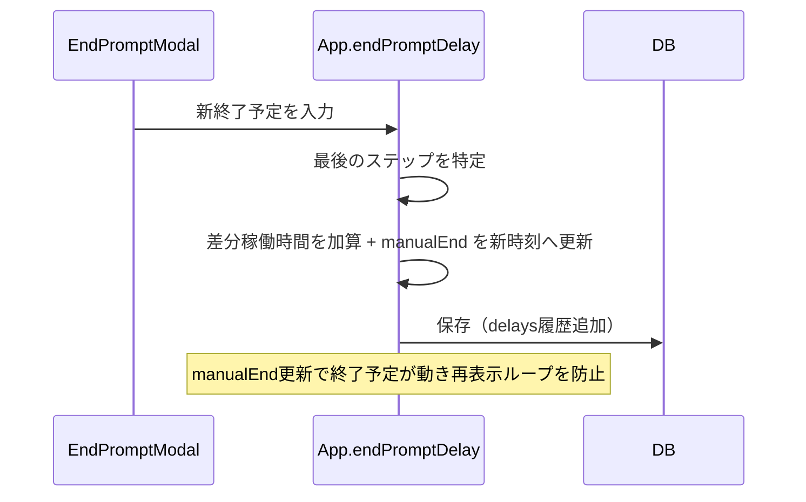

# 詳細設計書

| 項目 | 内容 |
|---|---|
| システム名称 | 工程図（koutei-zu） |
| 版数 | 1.0 |
| 作成日 | 2026-06-13 |
| 主対象ファイル | `src/App.jsx`（中核ロジック・全UI）／`src/firebase.js`（永続化） |

---

## 1. モジュール構成

### 1.1 ファイル構成

| ファイル | 役割 |
|---|---|
| `src/main.jsx` | エントリポイント。`<App />` をマウント。 |
| `src/App.jsx` | 状態管理・スケジューラ・全ビューコンポーネント（単一ファイル）。 |
| `src/firebase.js` | Firebase初期化、`tasksStore`／`storage`／認証ラッパー。 |
| `sync/Code.gs` | （任意）Google Apps Scriptによるシート同期。 |
| `firestore.rules` | Firestoreセキュリティルール。 |

### 1.2 コンポーネント階層

```
App
├── （認証前）サインイン画面
└── （認証後）
    ├── Header（ナビ・設定パネル）
    │   ├── TimeSelect
    │   ├── OvertimeManager     ※マスタ画面へ移設済み（設定には案内のみ）
    │   └── AbsenceManager      ※マスタ画面へ移設済み
    ├── InputView（入力）
    │   ├── Combobox / TimeSelect / EndTimeFields
    │   ├── QuoteModal（過去案件引用）
    │   └── ViewpointGroupList → ViewpointCard → StepRow
    ├── CalendarView → TaskBlock
    ├── AssigneeView → ViewpointGroupList
    ├── MessageView
    ├── DoneView → DoneTaskRow
    ├── MasterView（お客様/従業員/残業/欠勤/会社表示順）
    │   ├── OvertimeManager / AbsenceManager / CompanyOrderView
    ├── CompleteDialog（完了時の終了時刻入力）
    ├── ConfirmModal（開始移動・納期超過の確認）
    └── EndPromptModal（終了超過ポップアップ・視点単位）
```

---

## 2. 状態管理（App コンポーネント）

| state | 型 | 説明 |
|---|---|---|
| tasks | Task[] | 全タスク（マイグレーション・正規化済み）。 |
| settings | object | 営業時間・残業・欠勤・表示順等。 |
| projectOrder | string[] | 案件の手動並び順。 |
| customerMaster / employeeMaster | array | マスタ。 |
| form | object | 入力フォーム（viewpoints[].steps[] のネスト構造）。 |
| editMode | object\|null | 編集スコープ `{ type: 'step'|'viewpoint'|'project', ... }`。 |
| view | string | 現在の画面。 |
| now | Date | 1分ごと更新の現在時刻（経過進捗・終了予定再計算の駆動）。 |
| completeTarget | object\|null | 完了ダイアログ対象。 |
| startMoveConfirm | object\|null | 開始移動／納期超過の確認モーダル。 |
| auth | object | `{ user, allowed, ready }`。 |

- `tasksRef`（useRef）：常に最新tasksを参照し、差分書き込みの基準にする。

---

## 3. 中核アルゴリズム詳細

### 3.1 稼働枠の算出

| 関数 | 入出力 | 説明 |
|---|---|---|
| `getDailySlots(settings)` | → [{start,end}×2] | 午前・午後スロット（分）。 |
| `getDaySlots(d, settings)` | → スロット配列 | 土曜は午前のみ。 |
| `isNonWorkingDay(d)` | → boolean | 日曜、第2/4以外の土曜を非稼働とする。 |
| `dayOvertimeIntervals(assignee, date, overtimes)` | → [[s,e]…] | 当日該当の残業時間帯。 |
| `dayWorkSlots(assignee, date, settings)` | → [[s,e]…] | 通常枠＋残業枠をマージ（重複結合）。 |
| `dayAbsence(assignee, date, absences)` | → {allDay, intervals} | 当日の欠勤・不在。 |
| `dayFreeIntervals(...)` | → [[s,e]…] | 稼働枠から busy・欠勤を差し引いた空き。 |
| `subtractBusy(start, end, blocked)` | → [[s,e]…] | 区間差集合。 |

### 3.2 スケジューラ `scheduleTasks(tasks, settings, projectOrder, now)`

**処理フロー：**



**主要サブロジック：**

- `effectiveDuration(task)`
  - 残作業時間 `hours - completedHours` をそのまま所要時間とする（開始予定どおりに配置）。
  - 経過時間では終了予定を膨張させない（未記録のまま時間が経っても枠は伸びない）。0.5h タスクは常に 0.5h 枠。
  - 遅れの反映は「完了時の実終了時刻（actualEnd）」入力時のみ。`doneFloor` 経由で後続タスクの着手下限が後ろへずれる（要件F-08）。
- `fillTaskSlots(task, eTs, durationHours)`
  - `eTs` 以降の空き枠へ `durationHours` を分割充填。
  - `manualEnd`（開始より後の時のみ有効）でその時刻打ち切り。
- `baseTsOf(assignee)`：起点（startDate+startTime）とdoneFloorの遅い方。
- `lastEndByAssignee` / `vpLastEnd[vkey]`：担当者の直前終了・同視点の工程順の下限。

**vkey（視点キー）：** `` `${assignee}::${projectName}::${viewpointName}` ``

### 3.3 フォームプレビュー・納期チェック

| 関数 | 説明 |
|---|---|
| `formPreviewRecords(form, ...)` | フォーム内容をタスクレコード化（プレビュー用）。 |
| `simulateFormSchedule(form, allTasks, settings, projectOrder, now)` | 実データに混ぜてスケジュールし、開始/終了予定＋`moved`（開始移動）＋`deadlineViolations`（納期超過視点）を返す。 |

- 納期チェック：視点ごとの終了予定日（`fmtYMD(endDate)`）が `vp.deadline` を超えたら違反として収集（要件F-07）。
- 登録時に `handleSubmit` がこれを評価し、移動 or 納期超過があれば `ConfirmModal` を表示。

### 3.4 集約・正規化

| 関数 | 説明 |
|---|---|
| `migrateTask(task)` | 旧データの移行（taskName→viewpointName、priority正規化等）。 |
| `normalizePriorities(tasks)` | 会社ごとに優先順位を1..nへ再採番。 |
| `groupByViewpoint(tasks)` | 視点キーで集約。納期は最早を採用。 |
| `computeProjectOrder(active, projectOrder)` | 既定（会社ごと）＋手動並びを合成した案件順。 |
| `companySequence / companyRank / companyDisplayRank` | 会社の並び順ロジック。 |

---

## 4. 主要処理シーケンス

### 4.1 タスク登録（新規）



### 4.2 進捗入力 → 終了予定の自動調整



### 4.3 終了超過ポップアップ（遅延）



---

## 5. 主要関数仕様（App内ハンドラ）

| 関数 | 役割 |
|---|---|
| `handleSubmit` / `performSubmit` | 登録・更新の入口／本体。編集スコープ別に保存。 |
| `buildRecords(originalById)` | フォーム→タスクレコード化。視点ごとに manualStart=先頭/ manualEnd=末尾、deadlineを各タスクへ付与。 |
| `handleEdit / handleEditViewpoint / handleEditProject` | 3スコープの編集フォーム展開。視点ごとの開始/終了/納期を読込。 |
| `handleAddStepToViewpoint / handleAddViewpointToProject` | 視点へのステップ追加・案件への視点追加。 |
| `completeViewpoint / completeProject / confirmComplete` | 完了ダイアログ起動・確定（actualEnd記録）。 |
| `cancelProject` | 案件中止（実績保持・後続非影響）。 |
| `endPromptComplete / endPromptAddRevision / endPromptDelay / endPromptSnooze` | 終了超過ポップアップの4対応（視点単位）。 |
| `addOvertime / removeOvertime` | 残業の追加・削除。 |
| `addAbsence / removeAbsence` | 欠勤・不在の追加・削除。 |
| `setTaskManualStart / setTaskManualEnd / setActualEnd` | 個別タスクの時刻指定・実績編集。 |
| `moveUp / moveDown / changePriority / reorderTaskPriority` | 優先順位の変更（会社内）。 |
| `saveProjectOrder / saveProjectOrderPartial / reorderProjectFromCalendar` | 案件並び順の保存。 |

---

## 6. UIコンポーネント仕様（抜粋）

| コンポーネント | 主な責務・特記事項 |
|---|---|
| `InputView` | 登録フォーム＋進行中一覧。視点カードに開始/終了/納期欄。プレビューに納期超過警告。 |
| `ViewpointGroupList` | 案件→会社→視点の3層グループ化。納期順/会社別/担当者別の切替。視点カードは案件から1段インデント表示。 |
| `ViewpointCard` | 視点の進捗バー（経過＋実績の二重）、担当者振替、納期バッジ、各種操作。 |
| `StepRow` | ステップ行。完了/制作時間のインライン編集、開始/終了指定、遅延履歴表示、ドラッグ並び替え。 |
| `CalendarView` | 1日は横タイムライン（残業で時間軸延長）、全期間は午前/午後2分割セル。現在時刻ライン表示。 |
| `TaskBlock` | カレンダーのブロック。案件色パステル、ホワイト淡色、完了/中止/仮の識別、ツールチップ詳細。 |
| `MessageView` | 会社別業務連絡文・担当者別メッセージのテキスト生成とコピー。 |
| `DoneView / DoneTaskRow` | 完了一覧（日付別グループ・検索・実績編集）。 |
| `OvertimeManager / AbsenceManager` | 残業・欠勤の登録UI（マスタ画面に配置）。 |
| `EndPromptModal` | 終了超過の視点単位ポップアップ（完了/追加修正/遅延/後で）。 |
| `EndTimeFields / TimeSelect` | 日付＋時刻プルダウン入力（ネイティブtime非依存）。 |
| `Combobox` | 候補絞り込み＋自由入力の複合入力。 |

---

## 7. 永続化I/F仕様（firebase.js）

### 7.1 tasksStore（`workspaces/{wid}/tasks/{taskId}`）

| メソッド | 説明 |
|---|---|
| `subscribe(cb, onError)` | コレクションのonSnapshot購読。 |
| `upsert(task)` | 1件set。 |
| `remove(taskId)` | 1件delete。 |
| `batch(upserts, deletes)` | 一括（450件ごとに分割、Firestoreの500上限対策）。 |
| `listAll()` | 全件取得（移行用）。 |

### 7.2 storage（`workspaces/{wid}/data/{key}`）

| メソッド | 説明 |
|---|---|
| `get(key)` | 単発取得（onSnapshot1回）。 |
| `set(key, value)` | `{ value, updatedAt }` を保存。 |
| `delete(key)` | 削除。 |
| `subscribe(key, cb)` | キー単位のリアルタイム購読。 |

### 7.3 認証

| 関数 | 説明 |
|---|---|
| `signIn()` | Googleポップアップサインイン。 |
| `signOutUser()` | サインアウト。 |
| `subscribeAuth(cb)` | 状態購読。許可外メールは自動サインアウトし `deniedEmail` 通知。 |

---

## 8. エラーハンドリング・例外設計

| 事象 | 対応 |
|---|---|
| 保存失敗（書き込み例外） | console.errorログ＋必要に応じalert。楽観的更新済みのため画面は維持。 |
| onSnapshot不発（保険） | 15秒タイムアウトで `tasksLoaded` を立て、ローディングを解除。 |
| 入力バリデーション | 案件名必須、制作時間≧0、完了≦制作時間、時間帯の前後関係等をフォーム側で検証しalert。 |
| 名称変更の波及 | スコープ外の同名案件タスクへ反映する確認（`needsRename`）を挟む。 |
| 外部シート削除整合 | `deletedExternalIds` に記録し再同期での復活を防止。 |

---

## 9. テスト方針

- 純粋ロジック（`scheduleTasks` / `simulateFormSchedule` / `dayWorkSlots` 等）を `import` 抽出し、Nodeスクリプトで境界値検証する。
- 代表検証ケース（実施済み）：
  - 進捗連動：4h/現在10:00で完了2h→12:00、完了1h→14:00、完了3h→11:00。
  - 残業：10h案件に残業17:00–19:00で当日19:00終了、残業なしは翌営業日へ。
  - 欠勤：終日欠勤日には配置されない。
  - 納期：終了予定が納期日超過時に違反検出。
  - 遅延：新終了予定で `manualEnd` 更新し再表示ループが解消。
- ビルド検証：`npm run build` が警告・エラーなく通ること。

---

## 10. 既知の制約・今後の課題

- 祝日は未対応（土日・第2/4土曜のみ）。
- 経過自動加算は全担当者一律で、残業分は自動加算されない（個別に完了時間を加算）。
- 当初予定 vs 実績の集計レポートは未実装（遅延履歴は保持済み）。
- LINE等の外部進捗連携は将来検討（現状は手動入力）。
