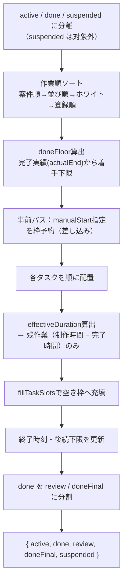
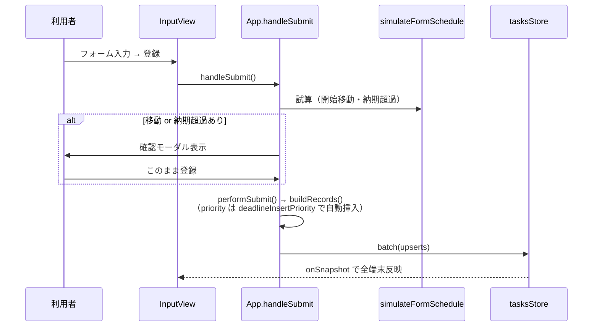
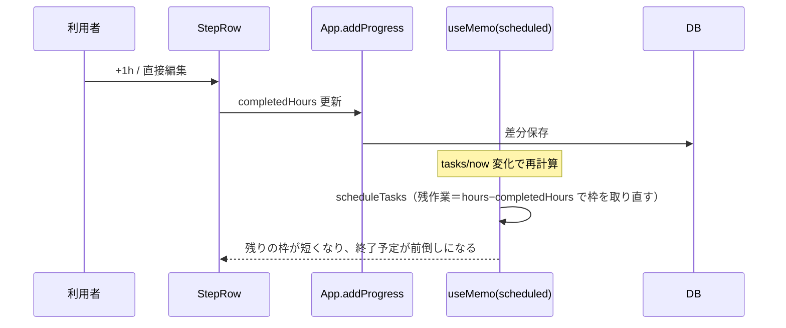
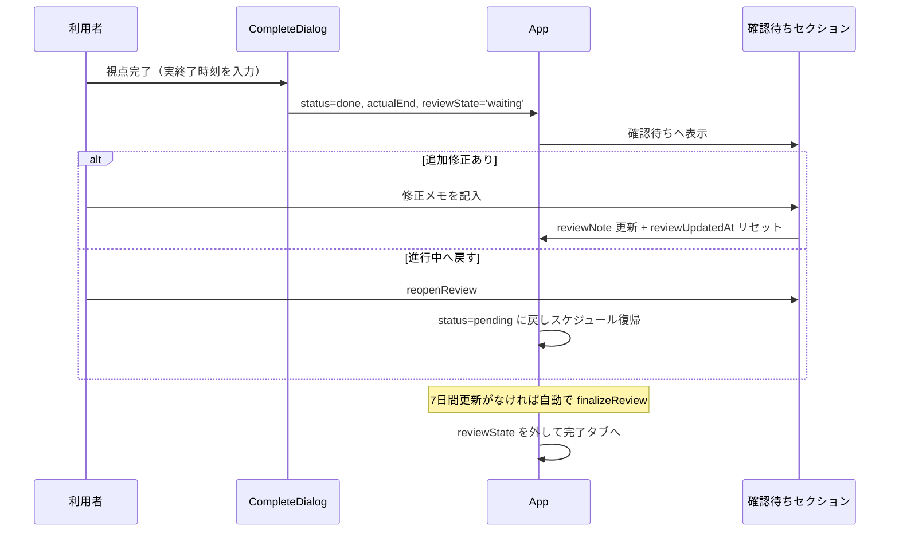
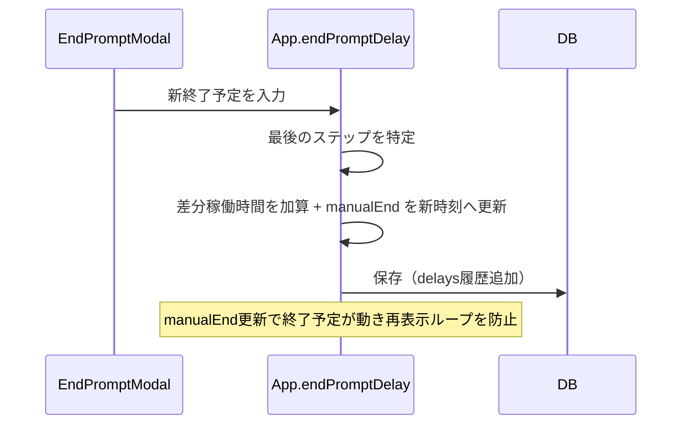
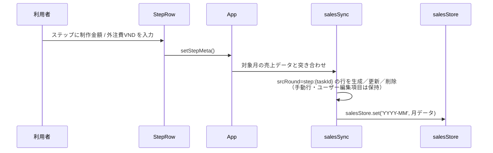

# 詳細設計書

| 項目 | 内容 |
|---|---|
| システム名称 | 工程図（koutei-zu） |
| 版数 | 2.0 |
| 作成日 | 2026-06-13 |
| 最終更新 | 2026-09-20（実装内容に合わせて全面改訂） |
| 主対象ファイル | `src/App.jsx`（状態管理・ハンドラ）／`src/lib/schedule.js`（スケジューラ）／`src/firebase.js`（永続化） |

---

## 1. モジュール構成

### 1.1 ファイル構成

2026-07 に単一ファイルから機能単位へ分割済み。おおよその規模（2026-09 時点、合計約14,800行）を併記する。

| ファイル | 行数目安 | 役割 |
|---|---:|---|
| `src/main.jsx` | 61 | エントリポイント。`<App />` をマウント。 |
| `src/App.jsx` | 2380 | 状態管理・Firestore購読・タスク操作ハンドラ・画面切替。 |
| `src/appContext.js` | 16 | `AppCtx` / `useApp()`。共有データとハンドラをビューへ渡す。 |
| `src/firebase.js` | 249 | Firebase初期化、認証、`tasksStore`／`storage`／`billingStore`／`salesStore`／`memberList`。 |
| `src/lib/schedule.js` | 898 | スケジューラ・マイグレーション・並び順・視点グループ化（純ロジック）。 |
| `src/lib/utils.js` | 322 | 日付・時刻・色・プリセット・稼働枠・祝日などの純ユーティリティ。 |
| `src/components/common.jsx` | 534 | 共通UI部品（モーダル・トースト・TimeSelect・DateTimeField・NavButton/NavGroup・Combobox 等）。 |
| `src/components/modals.jsx` | 200 | `QuoteModal`（過去案件引用）・`EndPromptModal`（終了予定超過）。 |
| `src/components/MemberSettings.jsx` | 68 | メンバー管理UI（設定パネル内）。 |
| `src/views/InputView.jsx` | 1563 | 案件タブ（登録フォーム＋下位タブ）。 |
| `src/views/input/ViewpointList.jsx` | 1361 | 視点グループ一覧・視点カード・ステップ行。 |
| `src/views/input/sections.jsx` | 412 | 制作中断・確認待ち・案件情報編集・担当者ボードの各セクション。 |
| `src/views/CalendarView.jsx` | 779 | カレンダー（1日／全期間）。 |
| `src/views/AssigneeView.jsx` | 99 | 担当者別ビュー。 |
| `src/views/MessageView.jsx` | 485 | サマリー（会社別連絡文・今週の予定）。 |
| `src/views/DoneView.jsx` | 302 | 完了一覧＋視点別修正集計。 |
| `src/views/MemoView.jsx` | 275 | タスクメモ。 |
| `src/views/MasterView.jsx` | 898 | マスタ（5タブ＋残業・欠勤マネージャ）。 |
| `src/billing/BillingView.jsx` | 733 | 帳票の一覧・エディタ。 |
| `src/billing/BillingDocument.jsx` | 473 | 帳票の印字コンポーネント（各ページ）。 |
| `src/billing/billingUtils.js` | 266 | 帳票の定数・雛形。 |
| `src/sales/SalesView.jsx` | 898 | 売上登録表。 |
| `src/sales/CompanySummaryView.jsx` | 301 | 会社別集計。 |
| `src/sales/salesUtils.js` | 252 | 売上の定数・集計ロジック。 |
| `src/project/ProjectSheetView.jsx` | 336 | 案件整理表。 |
| `src/viewpoint/viewpointUtils.js` | 368 | 視点・ステップ・ラウンドのロジック。 |
| `src/viewpoint/salesSync.js` | 254 | ステップ→売上行の自動同期（純ロジック）。 |
| `sync/Code.gs` | — | （任意）Google Apps Scriptによるシート同期。 |
| `firestore.rules` | — | Firestoreセキュリティルール。 |

### 1.2 コンポーネント階層

```
App（AppCtx.Provider で共有データ・ハンドラを供給）
├── （認証前）サインイン画面
└── （認証後）
    ├── Header（NavButton × 5 ／ NavGroup「集計・帳票」／データ更新／設定／サインアウト）
    │   └── 設定パネル（開始日時・営業時間・MemberSettings）
    ├── Suspense（lazy 読み込み）
    │   ├── InputView（案件）
    │   │   ├── 下位タブ：進行中一覧 / カレンダー / 担当者別
    │   │   ├── 登録フォーム（Combobox / TimeSelect / DateTimeField / EndTimeFields）
    │   │   ├── QuoteModal（過去案件引用）
    │   │   ├── 予測遅延・空き時間・おすすめ担当者の各セクション
    │   │   ├── 制作中断セクション / 確認待ちセクション（views/input/sections.jsx）
    │   │   ├── ViewpointGroupList → ViewpointCard → StepRow（views/input/ViewpointList.jsx）
    │   │   ├── CalendarView → TaskBlock
    │   │   └── AssigneeView → ViewpointGroupList
    │   ├── MessageView（サマリー）
    │   ├── DoneView → RevisionStatsSection / DoneTaskRow
    │   ├── MemoView（タスクメモ）
    │   ├── MasterView（5タブ＋OvertimeManager / AbsenceManager / CompanyOrderView / HolidayManager）
    │   ├── BillingView → BillingDocument（EstimatePage1 / OrderPage1 / InvoicePage1 / ConditionPage / SchedulePage / AnglePage）
    │   ├── SalesView
    │   ├── ProjectSheetView
    │   └── CompanySummaryView
    ├── CompleteDialog（完了時の終了時刻入力）
    ├── ConfirmModal / PromptModal（確認・入力。ネイティブ confirm/prompt は禁止）
    ├── DeadlineConfirmModal（納期超過の確認）
    ├── ToastStack（通知・取り消し）
    └── EndPromptModal（終了超過ポップアップ・視点単位）
```

> **UI規約**：`alert` / `confirm` / `prompt` および `<input type="datetime-local">` は使用禁止。`useApp()` の `confirmDialog` / `promptDialog` / `notify`、共通 `DateTimeField` を使う（ESLintで強制）。詳細は `docs/07_UI設計原則.md`。

### 1.3 共有コンテキスト（`useApp()`）

`App` が `AppCtx.Provider` に渡す `appValue` は、大きく次の4群で構成される。props のバケツリレーを避けるため、ビュー・カード類は `useApp()` で直接取得する。

| 群 | 主な内容 |
|---|---|
| UIテーマ | `colors` / `fontJP` / `fontDisplay` |
| 共有データ | `tasks` / `scheduled` / `settings` / `now` / `memos` / `projectOrder` / `projectList` / `viewpointList` / `assigneeList` / `companyList` / `customerMaster` / `employeeMaster` / `stepTypeMaster` / `companyOrder` / `usedCompanies` / `submitting` ほか |
| 操作ハンドラ | `handleEdit` 系、`addProgress`、`setTask*` 系、`completeProject` / `cancelProject` / `suspendProject` / `resumeProject`、`finalizeReview` / `reopenReview` / `setReviewNote`、`moveUp` / `moveDown` / `changePriority`、`createBillingFromViewpoint` ほか |
| マスタ・ダイアログ | `saveCustomerMaster` / `saveEmployeeMaster` / `saveStepTypeMaster` / `addOvertime` / `addAbsence` / `addHolidays` / `saveCompanyOrder`、`confirmDialog` / `promptDialog` / `notify`、`upsertMemo` / `deleteMemo` |

※ コンポーネント固有の値（group や task、フォーム state など）は従来どおり props で渡す。

---

## 2. 状態管理（App コンポーネント）

| state | 型 | 説明 |
|---|---|---|
| tasks | Task[] | 全タスク（マイグレーション・正規化済み）。 |
| settings | object | 営業時間・残業・表示順等（欠勤・祝日は別state）。 |
| absences / holidays | array | 欠勤・祝日（独立キーで購読）。 |
| projectOrder | string[] | 案件の手動並び順。 |
| customerMaster / employeeMaster / stepTypeMaster | array | マスタ。 |
| memos | array | タスクメモ。 |
| memberEmails | string[] | 許可メンバー（`data/allowedEmails`）。 |
| form | object | 入力フォーム（viewpoints[].steps[] のネスト構造）。 |
| editMode | object\|null | 編集スコープ `{ type: 'step' \| 'viewpoint' \| 'project', ... }`。 |
| view | string | 現在の画面（`input` / `message` / `done` / `memo` / `master` / `billing` / `sales` / `projectSheet` / `companySummary`）。 |
| now | Date | 1分ごと更新の現在時刻（経過進捗・終了予定再計算の駆動）。 |
| completeTarget | object\|null | 完了ダイアログ対象。 |
| confirmState / promptState / toasts | object\|null / array | 共通ダイアログ・トーストの制御。 |
| startMoveConfirm | object\|null | 開始移動／納期超過の確認モーダル。 |
| submitting | boolean | 登録・更新の送信中（ボタン連打防止）。 |
| refreshing / lastSync | boolean / Date | 手動データ更新の状態。 |
| auth | object | `{ user, allowed, ready }`。`user.isOwner` でオーナー判定。 |

- `tasksRef`（useRef）：常に最新tasksを参照し、差分書き込みの基準にする。
- `migrationDone`（useRef）：prodHistory→ステップ移行を一度きりにするフラグ。

---

## 3. 中核アルゴリズム詳細

### 3.1 稼働枠の算出（`src/lib/utils.js` ＋ `src/lib/schedule.js`）

| 関数 | 入出力 | 説明 |
|---|---|---|
| `getDailySlots(settings)` | → [{start,end}×2] | 午前・午後スロット（分）。 |
| `getDaySlots(d, settings)` | → スロット配列 | 土曜は午前のみ。 |
| `isNonWorkingDay(d)` | → boolean | 日曜、第2/4以外の土曜、**登録済みの祝日**を非稼働とする。 |
| `syncHolidays(list)` | — | 祝日リストを内部の `HOLIDAY_SET` に反映する（購読時に呼ぶ）。 |
| `isWorkingSaturday(d)` | → boolean | 第2・第4土曜の判定。 |
| `vietnamHolidayCandidates(year)` | → [{date,days,label}] | ベトナムの祝日候補（旧暦ベースは推定値）。 |
| `expandHolidayDates(list)` | → Set(日付) | `days` を展開して実日付の集合にする。 |
| `dayOvertimeIntervals(assignee, date, overtimes)` | → [[s,e]…] | 当日該当の残業時間帯。 |
| `dayWorkSlots(assignee, date, settings)` | → [[s,e]…] | 通常枠＋残業枠をマージ（重複結合）。 |
| `dayAbsence(assignee, date, absences)` | → {allDay, intervals} | 当日の欠勤・不在。 |
| `isOnLeaveAt(assignee, ts, absences)` | → boolean | その時刻が不在かどうか。 |
| `subtractBusy(start, end, blocked)` | → [[s,e]…] | 区間差集合。 |
| `elapsedHoursForSlots(...)` / `workingHoursBetweenTs(...)` | → number | 2時刻間の実稼働時間。 |

### 3.2 スケジューラ `scheduleTasks(tasks, settings, projectOrder, now)`

**処理フロー：**


```mermaid
flowchart TD
    A["active / done / suspended に分離<br/>（suspended は対象外）"] --> B["作業順ソート<br/>案件順→並び順→ホワイト→登録順"]
    B --> C["doneFloor算出<br/>完了実績(actualEnd)から着手下限"]
    C --> D["事前パス：manualStart指定を枠予約（差し込み）"]
    D --> E["各タスクを順に配置"]
    E --> F["effectiveDuration算出<br/>＝ 残作業（制作時間 − 完了時間）のみ"]
    F --> G["fillTaskSlotsで空き枠へ充填"]
    G --> H["終了時刻・後続下限を更新"]
    H --> I["done を review / doneFinal に分割"]
    I --> J["{ active, done, review, doneFinal, suspended }"]
```

**戻り値：**

| キー | 内容 |
|---|---|
| `active` | 配置済みの進行中タスク（開始・終了予定つき）。 |
| `done` | 完了済みタスク全体。 |
| `review` | `done` のうち `reviewState === 'waiting'`（確認待ち）。 |
| `doneFinal` | `done` のうち確認も済んだもの（完了タブ表示用）。 |
| `suspended` | 制作中断中（スケジュール対象外）。 |

**主要サブロジック：**

- `effectiveDuration(task)` … **残作業時間 `hours - completedHours` をそのまま所要時間とする**（開始予定どおりに配置）。
  - 経過時間では終了予定を膨張させない（未記録のまま時間が経っても枠は伸びない）。0.5h タスクは常に 0.5h 枠。
  - 遅れの反映は「完了時の実終了時刻（actualEnd）」入力時のみ。`doneFloor` 経由で後続タスクの着手下限が後ろへずれる（要件F-08）。
- `fillTaskSlots(task, eTs, durationHours)` … `eTs` 以降の空き枠へ `durationHours` を分割充填。`manualEnd`（開始より後の時のみ有効）でその時刻打ち切り。
- `baseTsOf(assignee)` … 起点（startDate+startTime）とdoneFloorの遅い方。
- `lastEndByAssignee` / `vpLastEnd[vkey]` … 担当者の直前終了・同視点の工程順の下限。

**vkey（視点キー）：** `` `${assignee}::${projectName}::${viewpointName}` ``

### 3.3 並び順の決定（優先順位の自動化）

| 関数 | 説明 |
|---|---|
| `deadlineKey(task)` / `effectiveDeadlineKey(task)` | 納期のソートキー。実効納期は視点の納期と案件納期を合わせて判断する。 |
| `deadlineInsertPriority(activeSameCompany, dlKey)` | **新規登録時の挿入位置を返す**。同じ会社の中で「納期（実効）の早い順」になる位置。 |
| `normalizePriorities(tasks)` | 会社ごとに並び順を1..nへ再採番。 |
| `computeDeadlineReorder(...)` | 納期変更に伴う並び替えの算出。 |
| `companySequence / companyRank / companyDisplayRank / compareCompanyDisplay` | 会社の並び順ロジック（`settings.companyOrder` 基準）。 |
| `computeProjectOrder(active, projectOrder)` | 既定（会社ごと）＋手動並びを合成した案件順。 |
| `sortAssigneesByMaster(list, employeeMaster)` | 従業員マスタの並び順で担当者を並べる。 |

> 旧版にあった「優先順位を会社ごとに1から人手で採番する」運用は廃止。編集時は既存の `form.priority` を保持し、新規登録時のみ `deadlineInsertPriority` で自動挿入する。

### 3.4 フォームプレビュー・納期チェック

| 関数 | 説明 |
|---|---|
| `formEditIds(form)` | 編集対象のタスクIDを集める。 |
| `formPreviewRecords(form, defaultPriority, taskById)` | フォーム内容をタスクレコード化（プレビュー用）。 |
| `simulateFormSchedule(form, allTasks, settings, projectOrder, now)` | 実データに混ぜてスケジュールし、開始/終了予定＋`moved`（開始移動）＋`deadlineViolations`（納期超過視点）を返す。 |

- 納期チェック：視点ごとの終了予定日が `vp.deadline` を超えたら違反として収集（要件F-07）。
- 登録時に `handleSubmit` がこれを評価し、移動 or 納期超過があれば確認モーダルを表示する。
- 同じ仕組みを「おすすめ担当者」にも使い、担当者を差し替えたときの終了予定を試算して比較する。

### 3.5 予測遅延・空き時間

| 関数 | 説明 |
|---|---|
| `computeLateRisks(scheduled, ...)` | 終了予定が納期を超える見込みの視点を抽出。一覧上部に警告表示する。 |
| `computeFreeHours(scheduled, settings, ...)` | 担当者ごとの空き稼働時間を算出。 |
| `latestActualEnd(tasks)` / `buildDoneSlots(...)` | 完了実績から着手下限（doneFloor）と占有枠を作る。 |
| `projectEndTs(group)` | 案件（視点グループ）の終了予定時刻。 |

### 3.6 集約・正規化

| 関数 | 説明 |
|---|---|
| `migrateTask(task)` | 旧データの移行（taskName→viewpointName、priority正規化、確認待ちフィールドの補完等）。 |
| `groupByViewpoint(tasks)` | 視点キーで集約。納期は最早を採用。 |
| `normalizeCustomerMaster(arr)` | お客様マスタの旧フラット形式を会社単位へ正規化。 |
| `normalizeStepTypes(list)` | ステップ種類マスタの欠損フィールドを補完（未設定なら既定7種）。 |

### 3.7 視点・ステップのロジック（`src/viewpoint/viewpointUtils.js`）

| 定数・関数 | 説明 |
|---|---|
| `ROUND_TYPES` | `initial`（初回／新規制作）・`add`（追加制作）・`fix`（修正制作）。`isDelivery` で納品カウント対象かを持つ。 |
| `DEFAULT_STEP_TYPES` | 既定7種（white / color / person_scene / white_fix / white_change / color_fix / color_change）。 |
| `deliveryBaseName` / `stepDeliveryName` | 納品名の生成（基礎名＋連番＋手動上書き）。 |
| `resolveViewpointSteps(group, stepTypes)` | 視点のステップ一覧を解決する。 |
| `classifyProdType(...)` | 制作種類（白色／色付など）の判定。 |
| `isOffshoreCompany(company, customerMaster)` | お客様マスタの `contractType === 'offshore'` 判定。 |
| `salesAreaOfCompany(company, customerMaster)` | `salesArea === 'intl'` なら国際、既定は国内。 |
| `computeEstimateVariance(...)` | 見積（制作時間）と実績（完了時間）の乖離を算出。 |
| `computeRevisionStats(tasks)` | 視点ごとの修正回数・修正時間を集計（完了タブの「視点別修正集計」の元データ）。 |

### 3.8 ステップ→売上の自動同期（`src/viewpoint/salesSync.js`）

**不変条件：**

1. 生成行は `srcVp`（視点キー）・`srcRound`（`step:{taskId}`）で識別する。**手動行（src 無し）は一切触らない。**
2. source が所有するフィールド（`company` / `person` / `projectName` / `prodType` / `prodName` / `prodAmount` / `inHouseOutsourcer` / `externalOutsourcer` / `outsourceVND` / `orderDate`）のみ毎回上書きする。
3. ユーザーが編集する項目（区分・納品日・請求/入金・備考・枚数など）は保持する。
4. 対象ステップが消えた生成行は削除する（＝視点から金額を消すと売上行も消える）。
5. 計上月は「ステップの依頼日（`stepRequestDate`）の月」。日付が無ければ `fallbackMonth`。

**売上区分の判定：**

| 契約形態（contractType） | 売上エリア（salesArea） | 区分 |
|---|---|---|
| offshore | domestic | `offshore_dom` |
| offshore | intl | `offshore_intl` |
| lab（既定） | domestic | `lab_dom` |
| lab（既定） | intl | `lab_intl` |

---

## 4. 主要処理シーケンス

### 4.1 タスク登録（新規）


```mermaid
sequenceDiagram
    participant U as 利用者
    participant V as InputView
    participant A as App.handleSubmit
    participant S as simulateFormSchedule
    participant DB as tasksStore

    U->>V: フォーム入力 → 登録
    V->>A: handleSubmit()
    A->>S: 試算（開始移動・納期超過）
    alt 移動 or 納期超過あり
        A->>U: 確認モーダル表示
        U->>A: このまま登録
    end
    A->>A: performSubmit() → buildRecords()<br/>（priority は deadlineInsertPriority で自動挿入）
    A->>DB: batch(upserts)
    DB-->>V: onSnapshot で全端末反映
```

### 4.2 進捗入力 → 終了予定の自動調整


```mermaid
sequenceDiagram
    participant U as 利用者
    participant R as StepRow
    participant A as App.addProgress
    participant M as useMemo(scheduled)
    U->>R: +1h / 直接編集
    R->>A: completedHours 更新
    A->>DB: 差分保存
    Note over M: tasks/now 変化で再計算
    M->>M: scheduleTasks（残作業＝hours−completedHours で枠を取り直す）
    M-->>R: 残りの枠が短くなり、終了予定が前倒しになる
```

### 4.3 完了 → 確認待ち → 完了タブ


```mermaid
sequenceDiagram
    participant U as 利用者
    participant D as CompleteDialog
    participant A as App
    participant S as 確認待ちセクション

    U->>D: 視点完了（実終了時刻を入力）
    D->>A: status=done, actualEnd, reviewState='waiting'
    A->>S: 確認待ちへ表示
    alt 追加修正あり
        U->>S: 修正メモを記入
        S->>A: reviewNote 更新 + reviewUpdatedAt リセット
    else 進行中へ戻す
        U->>S: reopenReview
        A->>A: status=pending に戻しスケジュール復帰
    end
    Note over A: 7日間更新がなければ自動で finalizeReview
    A->>A: reviewState を外して完了タブへ
```

### 4.4 終了超過ポップアップ（遅延）


```mermaid
sequenceDiagram
    participant P as EndPromptModal
    participant A as App.endPromptDelay
    P->>A: 新終了予定を入力
    A->>A: 最後のステップを特定
    A->>A: 差分稼働時間を加算 + manualEnd を新時刻へ更新
    A->>DB: 保存（delays履歴追加）
    Note over A: manualEnd更新で終了予定が動き再表示ループを防止
```

### 4.5 ステップの金額入力 → 売上行の自動生成


```mermaid
sequenceDiagram
    participant U as 利用者
    participant R as StepRow
    participant A as App
    participant Sync as salesSync
    participant DB as salesStore

    U->>R: ステップに制作金額 / 外注費VND を入力
    R->>A: setStepMeta()
    A->>Sync: 対象月の売上データと突き合わせ
    Sync->>Sync: srcRound=step:{taskId} の行を生成／更新／削除<br/>（手動行・ユーザー編集項目は保持）
    Sync->>DB: salesStore.set('YYYY-MM', 月データ)
```

---

## 5. 主要関数仕様（App内ハンドラ）

| 関数 | 役割 |
|---|---|
| `handleSubmit` / `performSubmit` / `performSubmitInner` | 登録・更新の入口／本体。編集スコープ別に保存。 |
| `buildRecords(originalById)` | フォーム→タスクレコード化。視点ごとに manualStart=先頭／manualEnd=末尾、deadlineを各タスクへ付与。 |
| `registerDraftAndEdit` | 入力途中の案件をそのまま登録して編集モードへ入る（スケジュール調整モーダルを挟まない）。 |
| `handleEdit / handleEditViewpoint / handleEditProject` | 3スコープの編集フォーム展開。視点ごとの開始/終了/納期を読込。 |
| `handleAddStepToViewpoint / handleAddViewpointToProject` | 視点へのステップ追加・案件への視点追加。 |
| `handleDelete / handleDeleteViewpoint` | ステップ・視点の削除（取り消しトースト付き）。 |
| `completeViewpoint / completeProject / confirmComplete` | 完了ダイアログ起動・確定（actualEnd記録 → 確認待ちへ）。 |
| `finalizeReview / reopenReview / setReviewNote / setReviewActualEnd` | 確認待ちの確定・差し戻し・メモ記入・実績修正。 |
| `suspendProject / resumeProject` | 制作中断・再開。 |
| `cancelProject` | 案件中止（実績保持・後続非影響）。 |
| `endPromptComplete / endPromptAddRevision / endPromptDelay / endPromptSnooze` | 終了超過ポップアップの4対応（視点単位）。 |
| `addOvertime / removeOvertime` | 残業の追加・削除。 |
| `addAbsence / removeAbsence` | 欠勤・不在の追加・削除。 |
| `addHolidays / removeHoliday` | 祝日の一括追加・削除。 |
| `setTaskManualStart / setTaskManualEnd / setActualEnd` | 個別タスクの時刻指定・実績編集。 |
| `setTaskHours / setTaskCompletedHours / addProgress` | 制作時間・完了時間の編集。 |
| `setStepMeta / setViewpointMeta / setViewpointDeadline / setProjectDeadline / saveProjectInfo` | ステップ・視点・案件のメタ情報編集。 |
| `reassignViewpoint / setTaskAssignee` | 担当者の振り替え。 |
| `createBillingFromViewpoint` | 視点から帳票を起こす。 |
| `moveUp / moveDown / changePriority / reorderTaskPriority` | 並び順の変更（会社内）。 |
| `saveProjectOrder / saveProjectOrderPartial / reorderProjectFromCalendar` | 案件並び順の保存。 |
| `saveCustomerMaster / saveEmployeeMaster / saveStepTypeMaster / saveCompanyOrder` | マスタの保存。 |
| `upsertMemo / deleteMemo` | タスクメモの保存・削除。 |
| `confirmDialog / promptDialog / notify` | 共通ダイアログ・トースト（ネイティブ confirm/prompt の代替）。 |
| `refreshData` | Firestoreから手動再取得。 |

---

## 6. UIコンポーネント仕様（抜粋）

| コンポーネント | 主な責務・特記事項 |
|---|---|
| `InputView` | 案件タブ。登録フォーム＋下位タブ（進行中一覧／カレンダー／担当者別）。予測遅延・空き時間・おすすめ担当者の各セクションを持つ。プレビューに納期超過警告。 |
| `ViewpointGroupList` | 案件→会社→視点の3層グループ化。納期順/会社別/担当者別の切替。視点カードは案件から1段インデント表示。 |
| `ViewpointCard` | 視点の進捗バー（経過＋実績の二重）、担当者振替、納期バッジ、制作中断、各種操作。 |
| `StepRow` | ステップ行。完了/制作時間のインライン編集、開始/終了指定、ステップ種類・金額・外注などの請求情報、遅延履歴表示、ドラッグ並び替え。 |
| `SuspendedSection` / `ReviewSection` | 制作中断中の案件、確認待ちの視点（追加修正メモ・進行中へ戻す）。 |
| `CalendarView` | 1日は横タイムライン（残業で時間軸延長）、全期間は午前/午後2分割セル。現在時刻ライン表示。祝日・不在はグレー。 |
| `TaskBlock` | カレンダーのブロック。案件色パステル、ホワイト淡色、完了/中止/仮の識別、ツールチップ詳細。 |
| `MessageView` | 会社別業務連絡文（朝／夕の2モード）・今週の予定（担当者別）のテキスト生成とコピー。案件がなくても常に表示する会社（TAMAZEN・SUMUS）を持つ。 |
| `DoneView` | 完了一覧（日付別グループ・検索・実績編集）と視点別修正集計（`computeRevisionStats`）。 |
| `MemoView` | 日付ごとのメモ（8色）。時刻つきメモはアプリ表示中にブラウザ通知。 |
| `MasterView` | 5タブ（お客様設定／従業員設定／ステップ設定／会社の表示順／ベトナムの祝日）＋残業・欠勤マネージャ。 |
| `BillingView` / `BillingDocument` | 帳票の一覧・エディタと印字。種別（見積/発注/請求）とステータスで絞り込み。印字は6種のページコンポーネント。 |
| `SalesView` | 月別の売上表。月次集計・外注費・制作枚数（締め日設定）・請求/入金チェックのカード。 |
| `ProjectSheetView` | 案件整理表（10列）。清算月／ご依頼日／納品日はその場で編集。 |
| `CompanySummaryView` | 会社別／担当者別／制作種類別の集計。締め日は売上表と共有。 |
| `OvertimeManager / AbsenceManager / HolidayManager` | 残業・欠勤・祝日の登録UI（マスタ画面に配置）。 |
| `EndPromptModal` | 終了超過の視点単位ポップアップ（完了/追加修正/遅延/後で）。 |
| `ConfirmModal / PromptModal / ToastStack` | ネイティブダイアログの代替。削除系には取り消し（undo）を付ける。 |
| `DateTimeField / EndTimeFields / TimeSelect / DurationSelect` | 日付＋時刻の入力（`datetime-local` 非依存）。 |
| `Combobox` | 候補絞り込み＋自由入力の複合入力。 |
| `NavButton / NavGroup` | ヘッダーのナビ。`NavGroup` が「集計・帳票」ドロップダウン。 |

---

## 7. 永続化I/F仕様（firebase.js）

### 7.1 tasksStore（`workspaces/{wid}/tasks/{taskId}`）

| メソッド | 説明 |
|---|---|
| `subscribe(cb, onError)` | コレクションのonSnapshot購読。 |
| `upsert(task)` | 1件set。 |
| `remove(taskId)` | 1件delete。 |
| `batch(upserts, deletes)` | 一括（450件ごとに分割、Firestoreの500上限対策）。 |
| `listAll()` | 全件取得（移行・手動更新用）。 |

### 7.2 storage（`workspaces/{wid}/data/{key}`）

| メソッド | 説明 |
|---|---|
| `get(key)` | 単発取得（onSnapshot1回）。 |
| `set(key, value)` | `{ value, updatedAt }` を保存。 |
| `delete(key)` | 削除。 |
| `subscribe(key, cb)` | キー単位のリアルタイム購読。 |

### 7.3 prefixStore 派生（billingStore / salesStore）

`prefixStore(prefix)` で作る同形のストア。`billingStore = prefixStore('bill_')`、`salesStore = prefixStore('sales_')`。
キーにプレフィックスを付けて `data/` 配下へ保存し、一覧取得・削除・一括保存ができる。

### 7.4 memberList（`data/allowedEmails`）

| メソッド | 説明 |
|---|---|
| `subscribe(cb)` | 許可メンバーの購読。 |
| `save(emails)` | 許可メンバーの保存（オーナーのみルールで許可）。 |

### 7.5 認証

| 関数 | 説明 |
|---|---|
| `signIn()` | Googleポップアップサインイン。 |
| `signOutUser()` | サインアウト。 |
| `subscribeAuth(cb)` | 状態購読。`OWNER_EMAILS` と `data/allowedEmails` の両方で許可判定し、許可外メールは自動サインアウトして `deniedEmail` を通知。`user.isOwner` を付与。 |

---

## 8. エラーハンドリング・例外設計

| 事象 | 対応 |
|---|---|
| 保存失敗（書き込み例外） | `console.error` ログ＋`notify()` でトースト表示。楽観的更新済みのため画面は維持。 |
| onSnapshot不発（保険） | 15秒タイムアウトで `tasksLoaded` を立て、ローディングを解除。「データ更新」ボタンで手動再取得できる。 |
| 入力バリデーション | 案件名必須、制作時間≧0、完了≦制作時間、時間帯の前後関係等をフォーム側で検証し `notify()` で表示（`alert` は使わない）。 |
| 名称変更の波及 | スコープ外の同名案件タスクへ反映する確認（`needsRename`）を挟む。 |
| 外部シート削除整合 | `deletedExternalIds` に記録し再同期での復活を防止。 |
| 誤削除 | 削除系の操作はトーストに「取り消し（undo）」を付ける（`docs/07` の原則）。 |
| 移行の二重実行 | `migrationDone`（useRef）と `migratedFromRound`（冪等キー）で一度きりに抑える。 |

---

## 9. テスト方針

- 純粋ロジック（`scheduleTasks` / `simulateFormSchedule` / `dayWorkSlots` / `salesSync` 等）は `src/lib/`・`src/viewpoint/` に分離済みなので、Nodeスクリプトから直接 import して境界値検証できる。
- スプレッドシート連携の純ロジックは `node sync/test/logic.test.mjs` で検証する（22ケース）。
- 代表検証ケース：
  - 進捗連動：4hのタスクで完了2h→残り2h枠、完了3h→残り1h枠（開始位置は動かない）。
  - 実績連動：完了時に actualEnd を入れると、後続タスクの着手がその時刻以降へずれる。
  - 残業：10h案件に残業17:00–19:00で当日19:00終了、残業なしは翌営業日へ。
  - 欠勤・祝日：終日欠勤日・登録済みの祝日には配置されない。
  - 納期：終了予定が納期日超過時に違反検出。
  - 遅延：新終了予定で `manualEnd` 更新し再表示ループが解消。
  - 売上同期：ステップの金額入力で行が生成され、金額を消すと行が消える。手動行は変化しない。
- ビルド検証：`npm run check`（ESLint）→ `npm run build` の順で必ず通す（build が check を自動実行）。
- UIに触れた場合は `npm run preview` でログイン画面が描画されることを最低限確認する（モジュールレベルのクラッシュ検出）。

---

## 10. 既知の制約・今後の課題

未実装項目の詳細は `docs/06_未実装機能設計書.md` を参照。主な制約は次のとおり。

- 稼働時間は全員共通。**担当者ごとの稼働時間（日本／ベトナムの時差）は未対応**（項目10）。
- 請求書ステータスと売上登録表の請求/入金日は**二重入力**（項目2）。
- 見積書の工程予定表は固定7列でラベル編集不可（項目3）、アングルページに画像を貼れない（項目4）。
- 外注費集計の対象者（`OUTSOURCERS`）がコードにハードコードされている（項目5）。
- タスクメモの通知はアプリを開いている間のみ（項目9）。
- 旧データのバックアップキー（`*_backup`）の削除導線がアプリ内に無い（項目7）。
- LINE等の外部進捗連携は将来検討（現状は手動入力）。
