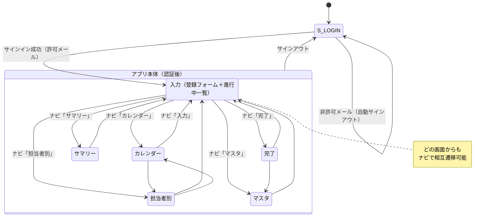
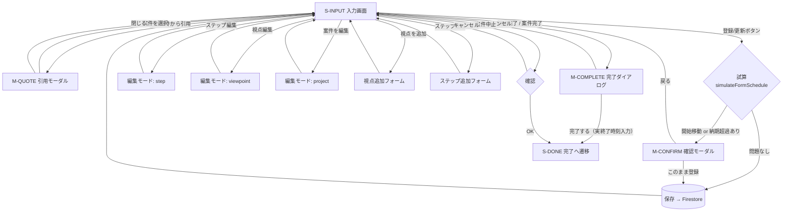
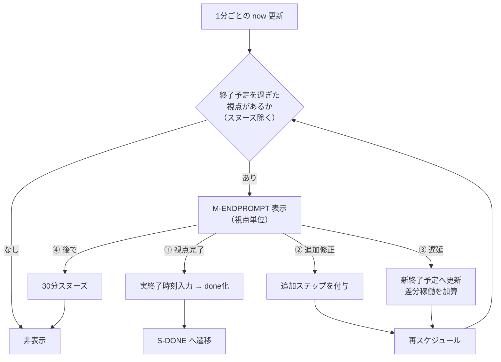
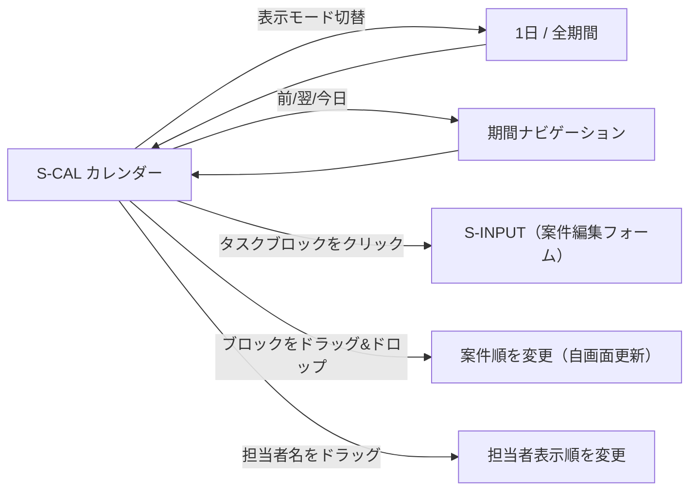
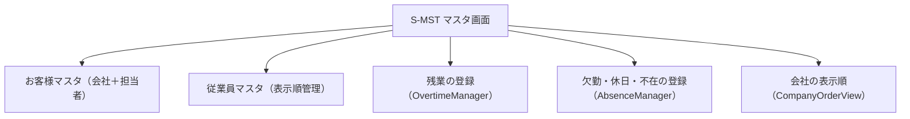
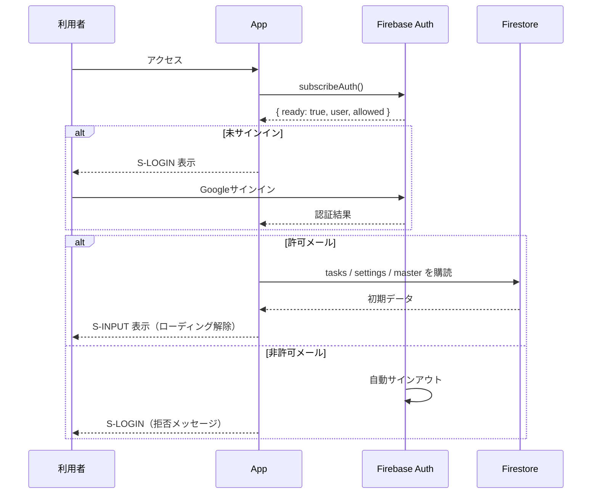

# 画面遷移図

| 項目 | 内容 |
|---|---|
| システム名称 | 工程図（koutei-zu） |
| 版数 | 1.0 |
| 作成日 | 2026-06-13 |

---

## 1. 画面・モーダル一覧

### 1.1 画面（ビュー）

| 画面ID | 画面名 | コンポーネント | 遷移トリガ |
|---|---|---|---|
| S-LOGIN | サインイン | App（認証前） | 初回アクセス／サインアウト後 |
| S-INPUT | 入力 | InputView | ナビ「入力」 |
| S-CAL | カレンダー | CalendarView | ナビ「カレンダー」 |
| S-ASG | 担当者別 | AssigneeView | ナビ「担当者別」 |
| S-MSG | サマリー | MessageView | ナビ「サマリー」 |
| S-DONE | 完了 | DoneView | ナビ「完了」 |
| S-MST | マスタ | MasterView | ナビ「マスタ」 |

### 1.2 モーダル・パネル（画面上にオーバーレイ表示）

| ID | 名称 | コンポーネント | 起動元 |
|---|---|---|---|
| M-SET | 設定パネル | Header内 | ⚙ボタン |
| M-QUOTE | 過去案件引用 | QuoteModal | S-INPUT「過去案件から引用」 |
| M-CONFIRM | 確認（開始移動／納期超過） | ConfirmModal | 登録/更新時の試算結果 |
| M-COMPLETE | 完了ダイアログ | CompleteDialog | 視点完了／案件完了 |
| M-ENDPROMPT | 終了超過ポップアップ | EndPromptModal | 視点の終了予定超過を検知（自動） |

---

## 2. 全体画面遷移図

> ナビゲーションバーは全画面共通でヘッダーに常駐し、6画面は相互に直接遷移できる。上図は代表的な経路のみを示す。

---

## 3. 入力画面（S-INPUT）の詳細遷移

入力画面は「登録フォーム」と「進行中タスク一覧」を持ち、編集・引用・各種操作の起点となる。

> 編集の3スコープ（step / viewpoint / project）はいずれも同一フォームに展開され、保存スコープが切り替わる。フォーム上部の見出しで現在の編集対象を表示する。

---

## 4. 終了超過ポップアップ（M-ENDPROMPT）の遷移

このポップアップは利用者操作ではなく、**1分ごとの再評価で視点の終了予定超過を検知すると自動表示**される。

---

## 5. カレンダー画面（S-CAL）の内部遷移

カレンダーは表示モードの切替を持ち、ブロッククリックで入力画面（案件編集）へ遷移する。

---

## 6. マスタ画面（S-MST）の構成

マスタ画面は単一スクロール内に5セクションを縦配置する（画面遷移ではなくセクション内編集）。

> 旧「表示順設定」タブと、設定パネル内にあった残業・欠勤登録は、本画面に集約済み。設定パネル（M-SET）には移動先の案内のみを残す。

---

## 7. 認証・起動フロー

---

## 8. 遷移一覧表（マトリクス）

| 遷移元＼遷移先 | 入力 | カレンダー | 担当者別 | サマリー | 完了 | マスタ | サインイン |
|---|:---:|:---:|:---:|:---:|:---:|:---:|:---:|
| サインイン | ○※1 | - | - | - | - | - | - |
| 入力 | ○※2 | ○ | ○ | ○ | ○※3 | ○ | ○※4 |
| カレンダー | ○※5 | ○ | ○ | ○ | ○ | ○ | ○※4 |
| 担当者別 | ○※2 | ○ | ○ | ○ | ○ | ○ | ○※4 |
| サマリー | ○ | ○ | ○ | ○ | ○ | ○ | ○※4 |
| 完了 | ○※5 | ○ | ○ | ○ | ○ | ○ | ○※4 |
| マスタ | ○ | ○ | ○ | ○ | ○ | ○ | ○※4 |

- ※1：許可メールでのサインイン成功時。
- ※2：編集（step/viewpoint/project）・視点/ステップ追加で自画面のフォームへ。
- ※3：視点完了／案件完了／案件中止の確定後。
- ※4：サインアウト操作時。
- ※5：カレンダー/完了のブロック・行クリックで案件編集フォーム（入力画面）へ。

> ナビゲーションバーにより、認証後の6画面は基本的に相互遷移可能。上表の「○」はナビ遷移＋特記の業務遷移を含む。
