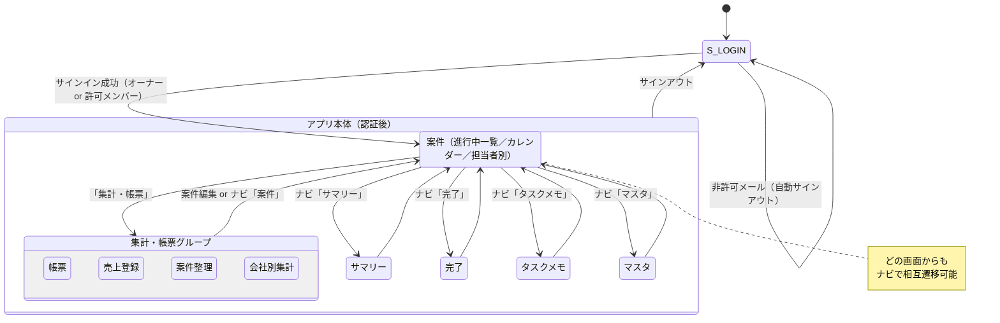
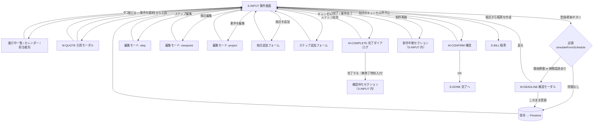
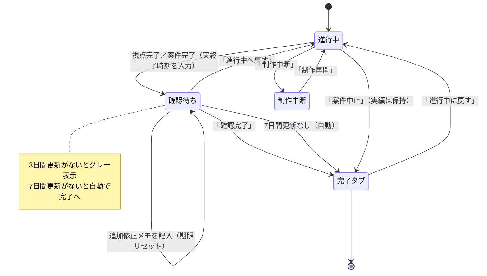
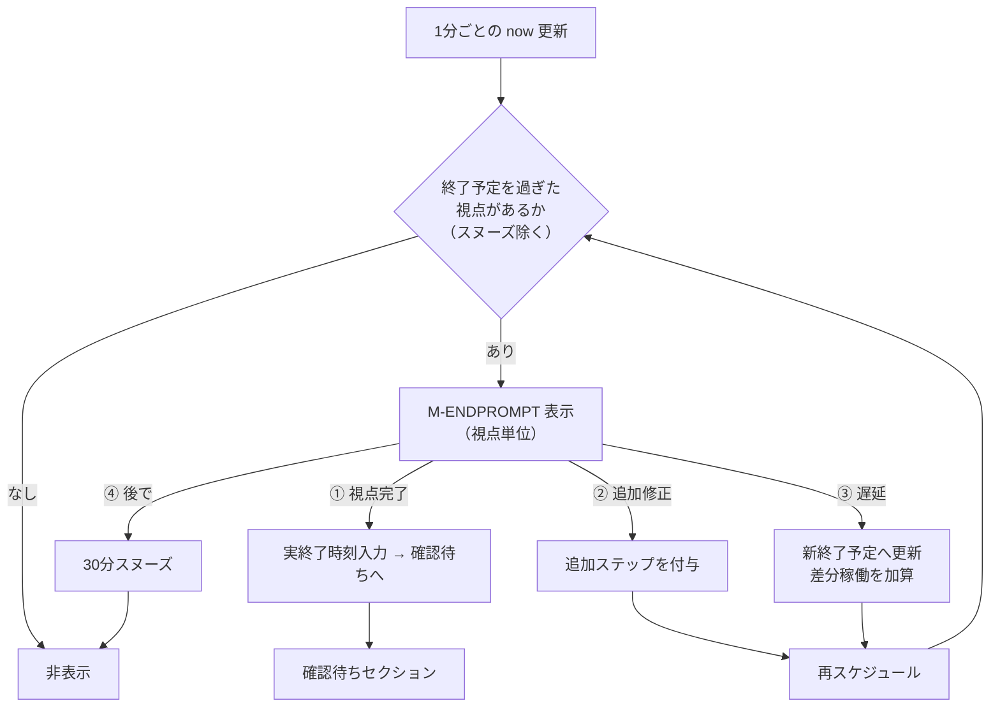
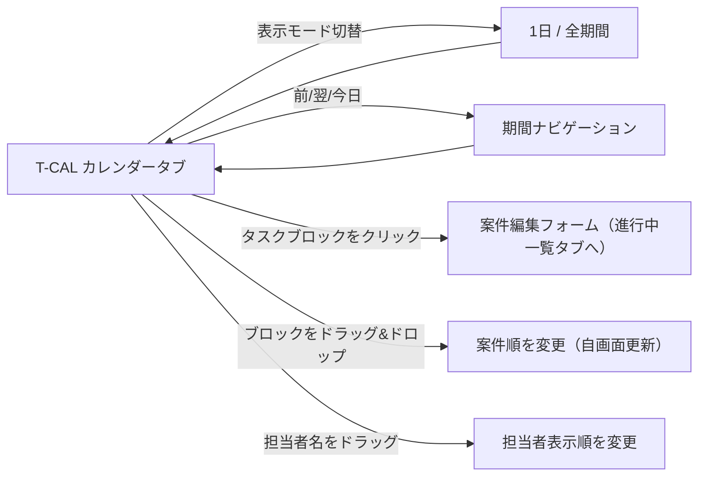
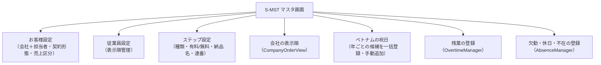
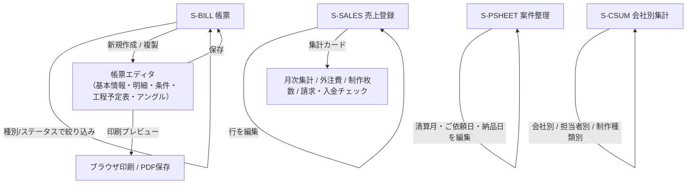
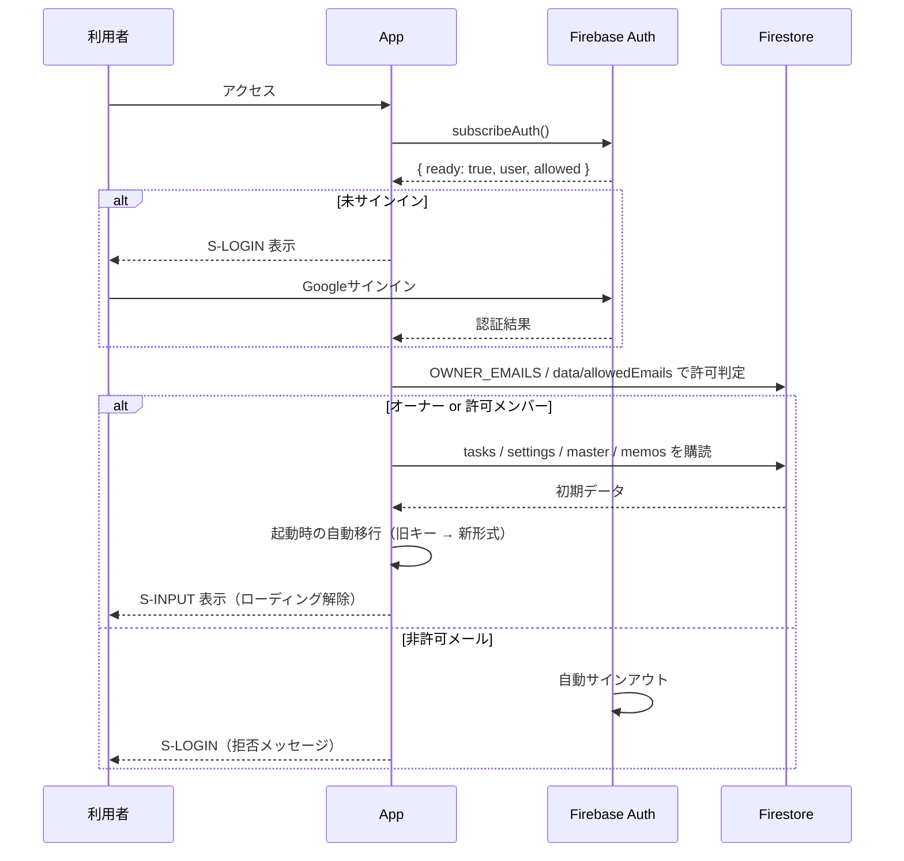

# 画面遷移図

| 項目 | 内容 |
|---|---|
| システム名称 | 工程図（koutei-zu） |
| 版数 | 2.0 |
| 作成日 | 2026-06-13 |
| 最終更新 | 2026-09-20（実装内容に合わせて全面改訂） |

---

## 1. 画面・モーダル一覧

### 1.1 画面（ビュー）

ナビゲーションは「毎日使うタブ（直接表示）」と「集計・帳票（ドロップダウン）」の2段構成。

**［直接表示タブ］**

| 画面ID | 画面名 | コンポーネント | 遷移トリガ |
|---|---|---|---|
| S-LOGIN | サインイン | App（認証前） | 初回アクセス／サインアウト後 |
| S-INPUT | 案件 | InputView | ナビ「案件」（既定の初期画面） |
| S-MSG | サマリー | MessageView | ナビ「サマリー」 |
| S-DONE | 完了 | DoneView | ナビ「完了」（完了件数バッジ付き） |
| S-MEMO | タスクメモ | MemoView | ナビ「タスクメモ」 |
| S-MST | マスタ | MasterView | ナビ「マスタ」 |

**［「集計・帳票」ドロップダウン］**

| 画面ID | 画面名 | コンポーネント | 遷移トリガ |
|---|---|---|---|
| S-BILL | 帳票 | BillingView | 「集計・帳票」→ 帳票 |
| S-SALES | 売上登録 | SalesView | 「集計・帳票」→ 売上登録 |
| S-PSHEET | 案件整理 | ProjectSheetView | 「集計・帳票」→ 案件整理 |
| S-CSUM | 会社別集計 | CompanySummaryView | 「集計・帳票」→ 会社別集計 |

> 旧版では「カレンダー」「担当者別」が独立画面（S-CAL / S-ASG）だったが、現在は **S-INPUT の下位タブ**に統合されている。旧「入力」タブは「案件」に改称。

### 1.2 案件画面（S-INPUT）の下位タブ

| タブID | 名称 | 内容 |
|---|---|---|
| T-LIST | 進行中一覧 | 視点カードの一覧（納期順／会社別／担当者別の切替）。既定タブ。 |
| T-CAL | カレンダー | 担当者×日付のタイムライン（1日／全期間）。 |
| T-ASG | 担当者別 | 担当者ごとの視点グループ。 |

> 一覧以外のタブへ切り替えると、編集中でなければ登録フォームは自動で折りたたまれる。

### 1.3 モーダル・パネル（画面上にオーバーレイ表示）

| ID | 名称 | コンポーネント | 起動元 |
|---|---|---|---|
| M-SET | 設定パネル | Header内（＋MemberSettings） | ⚙ボタン |
| M-QUOTE | 過去案件引用 | QuoteModal | S-INPUT「過去案件から引用」 |
| M-CONFIRM | 確認ダイアログ | ConfirmModal | 削除・振替などの確認（ネイティブ confirm の代替） |
| M-PROMPT | 入力ダイアログ | PromptModal | 名称入力など（ネイティブ prompt の代替） |
| M-DEADLINE | 納期超過の確認 | DeadlineConfirmModal | 登録/更新時の試算で納期超過を検知 |
| M-COMPLETE | 完了ダイアログ | CompleteDialog | 視点完了／案件完了 |
| M-ENDPROMPT | 終了超過ポップアップ | EndPromptModal | 視点の終了予定超過を検知（自動） |
| M-TOAST | トースト | ToastStack | 保存・削除などの通知（削除には「取り消し」付き） |

---

## 2. 全体画面遷移図

```mermaid
stateDiagram-v2
    [*] --> S_LOGIN

    S_LOGIN --> S_INPUT : サインイン成功（オーナー or 許可メンバー）
    S_LOGIN --> S_LOGIN : 非許可メール（自動サインアウト）

    state "アプリ本体（認証後）" as APP {
        state "案件（進行中一覧／カレンダー／担当者別）" as S_INPUT
        state "集計・帳票グループ" as REPORTS {
            S_BILL : 帳票
            S_SALES : 売上登録
            S_PSHEET : 案件整理
            S_CSUM : 会社別集計
        }

        S_INPUT --> S_MSG : ナビ「サマリー」
        S_INPUT --> S_DONE : ナビ「完了」
        S_INPUT --> S_MEMO : ナビ「タスクメモ」
        S_INPUT --> S_MST : ナビ「マスタ」
        S_INPUT --> REPORTS : 「集計・帳票」

        S_MSG --> S_INPUT
        S_DONE --> S_INPUT
        S_MEMO --> S_INPUT
        S_MST --> S_INPUT
        REPORTS --> S_INPUT : 案件編集 or ナビ「案件」

        note right of S_INPUT
            どの画面からも
            ナビで相互遷移可能
        end note
    }

    APP --> S_LOGIN : サインアウト

    S_MSG : サマリー
    S_DONE : 完了
    S_MEMO : タスクメモ
    S_MST : マスタ
```

> ナビゲーションバーは全画面共通でヘッダーに常駐する。直接表示の5画面と「集計・帳票」の4画面は相互に直接遷移できる。上図は代表的な経路のみを示す。

---

## 3. 案件画面（S-INPUT）の詳細遷移

案件画面は「登録フォーム」と「下位タブ（進行中一覧／カレンダー／担当者別）」を持ち、編集・引用・各種操作の起点となる。

```mermaid
flowchart TD
    INPUT["S-INPUT 案件画面"]

    INPUT -->|"タブ切替"| TABS["進行中一覧 / カレンダー / 担当者別"]
    TABS --> INPUT

    INPUT -->|"過去案件から引用"| QUOTE["M-QUOTE 引用モーダル"]
    QUOTE -->|"案件を選択"| INPUT
    QUOTE -->|"閉じる"| INPUT

    INPUT -->|"登録/更新ボタン"| CHECK{"試算<br/>simulateFormSchedule"}
    CHECK -->|"開始移動 or 納期超過あり"| CONFIRM["M-DEADLINE 確認モーダル"]
    CHECK -->|"問題なし"| SAVE[("保存 → Firestore")]
    CONFIRM -->|"このまま登録"| SAVE
    CONFIRM -->|"戻る"| INPUT
    SAVE --> INPUT

    INPUT -->|"ステップ編集"| EDIT_STEP["編集モード: step"]
    INPUT -->|"視点編集"| EDIT_VP["編集モード: viewpoint"]
    INPUT -->|"案件を編集"| EDIT_PRJ["編集モード: project"]
    INPUT -->|"視点を追加"| ADD_VP["視点追加フォーム"]
    INPUT -->|"ステップ追加"| ADD_STEP["ステップ追加フォーム"]
    EDIT_STEP --> INPUT
    EDIT_VP --> INPUT
    EDIT_PRJ --> INPUT
    ADD_VP --> INPUT
    ADD_STEP --> INPUT

    INPUT -->|"視点完了 / 案件完了"| COMPLETE["M-COMPLETE 完了ダイアログ"]
    COMPLETE -->|"完了する（実終了時刻入力）"| REVIEW["確認待ちセクション<br/>（S-INPUT 内）"]
    COMPLETE -->|"キャンセル"| INPUT

    INPUT -->|"制作中断"| SUSP["制作中断セクション<br/>（S-INPUT 内）"]
    SUSP -->|"制作再開"| INPUT

    INPUT -->|"案件中止"| CANCEL["M-CONFIRM 確認"]
    CANCEL -->|"OK"| DONE_VIEW["S-DONE 完了へ"]
    CANCEL -->|"キャンセル"| INPUT

    INPUT -->|"視点から帳票を作成"| BILL["S-BILL 帳票"]
```

> 編集の3スコープ（step / viewpoint / project）はいずれも同一フォームに展開され、保存スコープが切り替わる。フォーム上部の見出しで現在の編集対象を表示する。

---

## 4. 完了 → 確認待ち → 完了タブ の流れ

完了操作は**すぐに完了タブへは行かず**、いったん案件画面の「確認待ち」セクションに入る。

```mermaid
stateDiagram-v2
    [*] --> 進行中
    進行中 --> 確認待ち : 視点完了／案件完了（実終了時刻を入力）
    確認待ち --> 確認待ち : 追加修正メモを記入（期限リセット）
    確認待ち --> 進行中 : 「進行中へ戻す」
    確認待ち --> 完了タブ : 「確認完了」
    確認待ち --> 完了タブ : 7日間更新なし（自動）
    進行中 --> 制作中断 : 「制作中断」
    制作中断 --> 進行中 : 「制作再開」
    進行中 --> 完了タブ : 「案件中止」（実績は保持）
    完了タブ --> 進行中 : 「進行中に戻す」
    完了タブ --> [*]

    note right of 確認待ち
        3日間更新がないとグレー表示
        7日間更新がないと自動で完了へ
    end note
```

---

## 5. 終了超過ポップアップ（M-ENDPROMPT）の遷移

このポップアップは利用者操作ではなく、**1分ごとの再評価で視点の終了予定超過を検知すると自動表示**される。

```mermaid
flowchart TD
    TICK["1分ごとの now 更新"] --> EVAL{"終了予定を過ぎた<br/>視点があるか<br/>（スヌーズ除く）"}
    EVAL -->|"なし"| HIDE["非表示"]
    EVAL -->|"あり"| PROMPT["M-ENDPROMPT 表示<br/>（視点単位）"]

    PROMPT -->|"① 視点完了"| C1["実終了時刻入力 → 確認待ちへ"]
    PROMPT -->|"② 追加修正"| C2["追加ステップを付与"]
    PROMPT -->|"③ 遅延"| C3["新終了予定へ更新<br/>差分稼働を加算"]
    PROMPT -->|"④ 後で"| C4["30分スヌーズ"]

    C1 --> REVIEW["確認待ちセクション"]
    C2 --> RECALC["再スケジュール"]
    C3 --> RECALC
    C4 --> HIDE
    RECALC --> EVAL
```

---

## 6. カレンダータブ（T-CAL）の内部遷移

カレンダーは案件画面の下位タブ。表示モードの切替を持ち、ブロッククリックで案件編集フォームへ展開する。

```mermaid
flowchart LR
    CAL["T-CAL カレンダータブ"]
    CAL -->|"表示モード切替"| MODE["1日 / 全期間"]
    MODE --> CAL
    CAL -->|"前/翌/今日"| NAV["期間ナビゲーション"]
    NAV --> CAL
    CAL -->|"タスクブロックをクリック"| EDIT["案件編集フォーム（進行中一覧タブへ）"]
    CAL -->|"ブロックをドラッグ&ドロップ"| REORDER["案件順を変更（自画面更新）"]
    CAL -->|"担当者名をドラッグ"| ROWREORDER["担当者表示順を変更"]
```

---

## 7. マスタ画面（S-MST）の構成

マスタ画面は5つのタブで切り替える（画面遷移ではなくタブ内編集）。

```mermaid
flowchart TD
    MST["S-MST マスタ画面"]
    MST --> T1["お客様設定<br/>（会社＋担当者・契約形態・売上区分）"]
    MST --> T2["従業員設定<br/>（表示順管理）"]
    MST --> T3["ステップ設定<br/>（種類・有料/無料・納品名・連番）"]
    MST --> T4["会社の表示順<br/>（CompanyOrderView）"]
    MST --> T5["ベトナムの祝日<br/>（年ごとの候補を一括登録・手動追加）"]
    MST --> OT["残業の登録（OvertimeManager）"]
    MST --> AB["欠勤・休日・不在の登録（AbsenceManager）"]
```

> 設定パネル（M-SET）に残っているのは「開始日時・午前/午後の営業時間・メンバー管理」のみ。残業・欠勤は本画面へ集約済みで、設定パネルには移動先の案内だけを表示する。

---

## 8. 集計・帳票グループの内部遷移

```mermaid
flowchart TD
    BILL["S-BILL 帳票"]
    BILL -->|"種別/ステータスで絞り込み"| BILL
    BILL -->|"新規作成 / 複製"| EDITOR["帳票エディタ<br/>（基本情報・明細・条件・工程予定表・アングル）"]
    EDITOR -->|"保存"| BILL
    EDITOR -->|"印刷プレビュー"| PRINT["ブラウザ印刷 / PDF保存"]

    SALES["S-SALES 売上登録"]
    SALES -->|"月を選択"| SALES
    SALES -->|"行を編集"| SALES
    SALES -->|"集計カード"| CARDS["月次集計 / 外注費 / 制作枚数 / 請求・入金チェック"]

    PSHEET["S-PSHEET 案件整理"]
    PSHEET -->|"清算月・ご依頼日・納品日を編集"| PSHEET

    CSUM["S-CSUM 会社別集計"]
    CSUM -->|"会社別 / 担当者別 / 制作種類別"| CSUM
```

> ステップに金額を入れると `salesSync` が売上行を自動生成するため、S-INPUT での編集が S-SALES の内容に反映される（片方向。売上側の手動行は触らない）。

---

## 9. 認証・起動フロー

```mermaid
sequenceDiagram
    participant U as 利用者
    participant App as App
    participant Auth as Firebase Auth
    participant FS as Firestore

    U->>App: アクセス
    App->>Auth: subscribeAuth()
    Auth-->>App: { ready: true, user, allowed }
    alt 未サインイン
        App-->>U: S-LOGIN 表示
        U->>Auth: Googleサインイン
        Auth-->>App: 認証結果
    end
    App->>FS: OWNER_EMAILS / data/allowedEmails で許可判定
    alt オーナー or 許可メンバー
        App->>FS: tasks / settings / master / memos を購読
        FS-->>App: 初期データ
        App->>App: 起動時の自動移行（旧キー → 新形式）
        App-->>U: S-INPUT 表示（ローディング解除）
    else 非許可メール
        Auth->>Auth: 自動サインアウト
        App-->>U: S-LOGIN（拒否メッセージ）
    end
```

---

## 10. 遷移一覧表（マトリクス）

| 遷移元＼遷移先 | 案件 | サマリー | 完了 | タスクメモ | マスタ | 帳票 | 売上登録 | 案件整理 | 会社別集計 | サインイン |
|---|:---:|:---:|:---:|:---:|:---:|:---:|:---:|:---:|:---:|:---:|
| サインイン | ○※1 | - | - | - | - | - | - | - | - | - |
| 案件 | ○※2 | ○ | ○※3 | ○ | ○ | ○※6 | ○ | ○ | ○ | ○※4 |
| サマリー | ○ | ○ | ○ | ○ | ○ | ○ | ○ | ○ | ○ | ○※4 |
| 完了 | ○※5 | ○ | ○ | ○ | ○ | ○ | ○ | ○ | ○ | ○※4 |
| タスクメモ | ○ | ○ | ○ | ○ | ○ | ○ | ○ | ○ | ○ | ○※4 |
| マスタ | ○ | ○ | ○ | ○ | ○ | ○ | ○ | ○ | ○ | ○※4 |
| 帳票 | ○ | ○ | ○ | ○ | ○ | ○ | ○ | ○ | ○ | ○※4 |
| 売上登録 | ○※5 | ○ | ○ | ○ | ○ | ○ | ○ | ○ | ○ | ○※4 |
| 案件整理 | ○ | ○ | ○ | ○ | ○ | ○ | ○ | ○ | ○ | ○※4 |
| 会社別集計 | ○ | ○ | ○ | ○ | ○ | ○ | ○ | ○ | ○ | ○※4 |

- ※1：オーナーまたは許可メンバーでのサインイン成功時。
- ※2：編集（step/viewpoint/project）・視点/ステップ追加、下位タブ（進行中一覧/カレンダー/担当者別）の切替で自画面内を移動。
- ※3：案件中止の確定後、または確認待ちの確認完了後。
- ※4：サインアウト操作時。
- ※5：完了一覧の行・売上表の行から案件編集フォーム（案件画面）へ。
- ※6：視点カードの「帳票を作成」から。

> ナビゲーションバーにより、認証後の9画面は基本的に相互遷移可能。上表の「○」はナビ遷移＋特記の業務遷移を含む。
